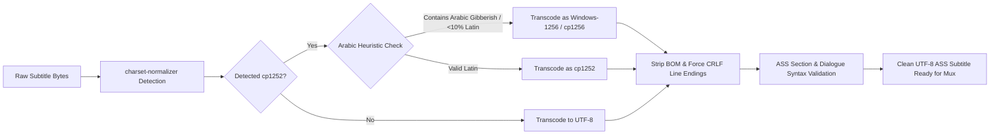

# Anime Studio v3 🎬✨

[](https://www.python.org/)
[](https://wiki.qt.io/Qt_for_Python)
[](https://mypy-lang.org/)
[](https://github.com/astral-sh/ruff)
[](https://pytest.org/)
[-orange.svg)](https://en.wikipedia.org/wiki/Hexagonal_architecture_(software))

**Anime Studio v3** is an enterprise-grade, forensic desktop automation pipeline designed for anime archiving, subtitle forensic repair, multi-source font hunting, and non-destructive Matroska (`.mkv`) muxing.

Built from the ground up on strict **Hexagonal Architecture (Ports & Adapters)**, modern **PySide6 + qasync**, and an async-first engine, Anime Studio solves the historical challenges of subtitle desynchronization, missing font attachments, encoding corruption (including legacy Arabic Windows-1256/1252 pitfalls), and disk thrashing during batch processing.

---

## 📑 Table of Contents

- [Key Capabilities](#-key-capabilities)
- [System Architecture](#-system-architecture)
- [Font Acquisition Architecture (6-Layer Hunter Chain)](#-font-acquisition-architecture-6-layer-hunter-chain)
- [Subtitle Forensic Engine & Encoding Guarantees](#-subtitle-forensic-engine--encoding-guarantees)
- [Data Safety, Checkpointing & Multi-Level Undo](#-data-safety-checkpointing--multi-level-undo)
- [Two-Panel PySide6 GUI Design](#-two-panel-pyside6-gui-design)
- [External Dependencies & Binary Resolution](#-external-dependencies--binary-resolution)
- [Storage Layout](#-storage-layout)
- [Installation & Quickstart](#-installation--quickstart)
- [Configuration Reference](#-configuration-reference)
- [Quality Gates & Testing](#-quality-gates--testing)
- [Agent & Contributor Onboarding Guide](#-agent--contributor-onboarding-guide)
- [Project Roadmap](#-project-roadmap)

---

## 🌟 Key Capabilities

1. **Forensic ASS/SSA Subtitle Normalization & Repair**:
   - Automatic character encoding detection via `charset-normalizer` with dedicated heuristic fallback for Arabic (`cp1252` $\rightarrow$ `cp1256` rescue).
   - Normalization to UTF-8 (without BOM) and standard `\r\n` line endings required by ASS specifications.
   - Dialogue timing alignment and structural ASS section integrity validation.

2. **6-Layer Font Hunting & Attachment Subsystem**:
   - Fallback chain spanning local persistent caches, embedded MKV attachments, episode sibling folders, OS system directories, 6 specialized network scrapers/APIs, and DuckDuckGo search fallbacks.
   - Font introspection, family name matching, and TTF/OTF sanitization via `fontTools` and `ots-sanitize`.

3. **High-Performance Semaphore-Gated Pipeline**:
   - Concurrency control preventing disk thrashing on large SSDs/HDDs (`max_concurrent_disk_io` semaphore).
   - Async-first non-blocking execution using `asyncio` and `qasync`.

4. **Non-Destructive Operations & Multi-Level Undo**:
   - Zero destructive writes: original files are backed up to `.anime_studio_trash/` with timestamped tags.
   - Background auto-cleanup of trash items older than 30 days without user friction.
   - Atomic temporary file creation with atomic filesystem rename.
   - Checkpoint-based resumption (`pipeline_checkpoint.toml`) and full multi-level rollbacks via `UndoService` and `RunManifest`.

5. **Modern Two-Panel PySide6 Desktop GUI**:
   - Instant startup (<1s) powered by cached `show_index.toml` (no long auto-scans).
   - Lazy on-demand show scanning with rich status badges (*Muxed*, *Pending*, *Skipped*, *Error*).
   - Collapsible activity feed, drag-and-drop font ingestion, and responsive dark theming (`pyqtdarktheme`).

---

## 🏛️ System Architecture

Anime Studio strictly complies with **Hexagonal (Ports & Adapters)** architecture. Business logic is completely decoupled from I/O adapters, external subprocesses, and GUI frameworks.

```
┌─────────────────────────────────────────────────────────────────────────────┐
│                           PRESENTATION LAYER (src/gui/)                     │
│    PySide6 Widgets (ShowSidebar, EpisodeTable, ActivityFeed, ProgressPanel) │
│       Bridged via qasync.QEventLoop + SignalBridge (Pure Consumer)          │
└──────────────────────────────────────┬──────────────────────────────────────┘
                                       │ dynamic composition root (bootstrap.py)
┌──────────────────────────────────────▼──────────────────────────────────────┐
│                            CORE LAYER (src/core/)                           │
│  PipelineRunner │ FontResolver │ SubtitleRepair │ MuxPlanner │ ShowIndexMgr │
│  UndoService    │ Checkpoint   │ FontIngestion  │ FontCache  │ LogExport    │
└──────────────────┬──────────────────────────────────────────┬───────────────┘
                   │                                          │
┌──────────────────▼──────────────────┐    ┌──────────────────▼───────────────┐
│       PORTS (src/ports/)            │    │       MODELS (src/models/)       │
│  SubprocessPort  │ MkvMergePort     │    │  Pure Data Structures / Pydantic │
│  FontHunterPort  │ FilesystemPort   │    │  Episode, SubtitleFile, Font     │
│  HttpClientPort  │ MkvExtractPort   │    │  ShowSummary, RunManifest        │
└──────────────────┬──────────────────┘    └──────────────────────────────────┘
                   │
┌──────────────────▼──────────────────────────────────────────────────────────┐
│                          ADAPTERS & HUNTERS LAYER                           │
│  Adapters (src/adapters/):                                                  │
│    mkvmerge, mkvextract, ffmpeg, alass, ffsubsync, ots-sanitize, httpx      │
│  Hunters (src/hunters/):                                                    │
│    MkvExtract, SiblingFont, SystemFont, GoogleFonts, DaFont, FontSpace,     │
│    FontSquirrel, BeFonts, ArabicFonts, SearchEngine                         │
└─────────────────────────────────────────────────────────────────────────────┘
```

### Layer Boundaries & Import Rules

| Layer | Path | Import Restrictions |
| :--- | :--- | :--- |
| **Domain Models** | `src/models/` | **Imports NOTHING** from this project. Pure dataclasses & Pydantic models. |
| **Ports** | `src/ports/` | Imports `src/models/` only. Abstract protocols (`typing.Protocol`). |
| **Core Services** | `src/core/` | Imports `src/models/`, `src/ports/` only. Stateless async business logic. |
| **Hunters** | `src/hunters/` | Imports `src/models/`, `src/ports/` only. |
| **Adapters** | `src/adapters/` | Imports `src/models/`, `src/ports/` only. Implements ports. |
| **Presentation** | `src/gui/` | Pure consumer. Injected via `src/gui/bootstrap.py`. No direct core/adapter imports in widgets. |

*These boundary rules are automatically enforced via static AST inspection in `tests/unit/gui/test_boundary.py` and `tests/unit/test_architecture_layering.py`.*

---

## 🔍 Font Acquisition Architecture (6-Layer Hunter Chain)

Anime Studio resolves missing subtitle fonts through an extensible, priority-ranked 6-layer hunter chain (`HunterRegistry`).

```
[Layer 0] Local Cache        --> .anime_studio/font_cache/ (Instant hit, SHA256 hashed)
    │ (miss)
[Layer 1] MKV Extraction     --> mkvextract scans embedded font attachments in source MKVs
    │ (miss)
[Layer 2] Sibling Scan       --> Scans "Fonts/", "attachments/" sibling dirs adjacent to video
    │ (miss)
[Layer 3] System Fonts       --> C:\Windows\Fonts, ~/Library/Fonts, /usr/share/fonts
    │ (miss)
[Layer 4] Network Scrapers   --> Parallel circuit-breaker-protected hunters:
                                 • Google Fonts (Official API)
                                 • DaFont (HTML parser)
                                 • FontSpace (API/Scraper)
                                 • FontSquirrel (Web API)
                                 • BeFonts (Catalog parser)
                                 • ArabicFonts (Specialized Arabic typography portal)
    │ (miss)
[Layer 5] Search Engine      --> DuckDuckGo fallback query with strict sanitization & download
```

### Hunter Reliability & Safety Features
- **Circuit Breakers**: Hunters monitor consecutive network failures. After 3 failures (`circuit_breaker_threshold`), the circuit opens and skips the hunter for the duration of the session.
- **Rate Limiting**: Configurable requests-per-second thresholds per source.
- **Font Sanitization**: Downloaded fonts are validated and sanitized using `fontTools` and `ots-sanitize` to prevent Matroska corruption.

---

## 📝 Subtitle Forensic Engine & Encoding Guarantees

Subtitle corruption and garbled characters (mojibake) are systematically eliminated through a multi-stage validation pipeline:



---

## 🛡️ Data Safety, Checkpointing & Multi-Level Undo

- **Non-Destructive Operations**: Source files are never modified in place. Replacements move old files to `.anime_studio_trash/<filename>.<timestamp>` before writing new files.
- **Atomic Writes**: MKV muxing and subtitle modifications write to temporary staging files (`.tmp.mkv`) and perform an atomic filesystem replace upon successful completion and verification.
- **Pipeline Checkpoints (`pipeline_checkpoint.toml`)**: Interrupted runs can be resumed seamlessly. Checkpoints record episode-by-episode progress and state.
- **Multi-Level Undo (`UndoService`)**:
  - **Level 1 (Full Restore)**: Restores original MKVs, restores original subtitles from `.anime_studio_trash/`, and clears run artifacts.
  - **Level 2 (Subtitles Only)**: Reverts subtitle repairs while leaving muxed MKVs untouched.
  - **Level 3 (MKVs Only)**: Restores original MKVs while keeping repaired subtitle files.

---

## 🖥️ Two-Panel PySide6 GUI Design

The user interface follows a modern two-panel desktop layout:

```
┌────────────────────────────────────────────────────────────────────────────────────────┐
│  Anime Studio v3                  Library: D:/Entertainment/Anime            [⚙ Settings] │
├──────────────────────┬─────────────────────────────────────────────────────────────────┤
│ SHOWS                │ Hunter x Hunter (2011)                                          │
│ ┌──────────────────┐ │ ┌─────────────────────────────────────────────────────────────┐ │
│ │ ● Hunter x Hunter│ │ │ [☑] Episode           │ Subtitle Match   │ Status           │ │
│ │   148 ready      │ │ ├───────────────────────┼──────────────────┼──────────────────┤ │
│ │ ● Bleach         │ │ │ [✔] Episode 01.mkv    │ ep01_ara.ass     │ [ Muxed (Green) ]│ │
│ │   366 ready      │ │ │ [✔] Episode 02.mkv    │ ep02_ara.ass     │ [Pending (Amber)]│ │
│ │ ○ Naruto         │ │ │ [ ] Episode 03.mkv    │ (Embedded)       │ [ Skipped (Gray)]│ │
│ │   220 ready      │ │ └─────────────────────────────────────────────────────────────┘ │
│ │                  │ │                                                                 │
│ │                  │ │ [ Run 2 Selected ]         [ ⏹ Stop ]            [ ⎌ Undo ]      │
│ │                  │ ├─────────────────────────────────────────────────────────────────┤
│ │                  │ │ ▰▰▰▰▰▰▰▰▰▰▰▰▰▰▰▰▰▰▰▰▰▱▱▱▱▱▱▱ 75% — Muxing Episode 02.mkv          │
│ ├──────────────────┤ ├─────────────────────────────────────────────────────────────────┤
│ │ [+ Add Folder] ↻ │ │ ▶ Activity Log (2 errors, 14 fonts cached)        [Export] [Clear] │
└──────────────────────┴─────────────────────────────────────────────────────────────────┘
```

- **Instant Sidebar Population**: Uses `.anime_studio/show_index.toml` to load libraries with hundreds of shows in milliseconds without disk scanning.
- **On-Demand Single Folder Scan**: Clicking "Add Folder" scans only that specific directory without freezing or scanning the entire drive.
- **Rich Status Badges**: Custom Qt delegates paint visual indicators for `Muxed`, `Pending`, `Skipped`, and `Error`.
- **Collapsible Activity Feed**: Keeps the workspace clean while providing expandable structured logs on demand.

---

## ⚙️ External Dependencies & Binary Resolution

Anime Studio integrates with standard media tools. External tools are resolved dynamically at startup across Windows-first discovery locations and system PATH.

### Binary Resolution Order (Windows):
1. `~\scoop\shims\<tool>.exe`
2. `~\scoop\apps\<tool>\current\**\<tool>.exe`
3. `C:\Program Files\mpv\<tool>.exe`
4. `C:\Program Files\<win_folder_name>\**\<tool>.exe`
5. `shutil.which("<tool>")` *(Standard PATH resolution on all OS platforms)*

### Dependency Classification Table:

| Binary | Role | Classification | Failure Behavior | Installation |
| :--- | :--- | :--- | :--- | :--- |
| **`ffmpeg`** | Audio extraction, stream probing | **CRITICAL** | Application refuses to start | `scoop install ffmpeg` / `winget install Gyan.FFmpeg` |
| **`mkvmerge`** | Matroska muxing & stream inspection | **CRITICAL** | Application refuses to start | `scoop install mkvtoolnix` / [MKVToolNix](https://mkvtoolnix.download/) |
| **`mkvextract`**| Font attachment extraction | **CRITICAL** | Application refuses to start | Included with MKVToolNix |
| **`alass`** | Subtitle synchronization | **OPTIONAL** | Logs warning; falls back to ffsubsync | `scoop install alass` / [alass releases](https://github.com/kaigi/alass) |
| **`ots-sanitize`**| OpenType font sanitization | **OPTIONAL** | Logs warning; uses fontTools repair only | `scoop install ots` / [ots releases](https://github.com/khaledhosny/ots) |
| **`ffsubsync`** | Subtitle voice-activity sync | **Python Env** | Installed automatically via `uv` / `pip` | Included in project dependencies |

---

## 💾 Storage Layout

Storage is cleanly split between **Volatile (User Preferences)** and **Permanent (Archival Data)** to survive OS reinstalls:

```
C: (VOLATILE — Recreatable User Preferences):
└── %APPDATA%\AnimeStudio\
    └── config.toml

D: (PERMANENT — Survives Windows/OS Reinstalls):
├── D:\Entertainment\.anime_studio\
│   ├── font_cache\             # Immutable font binary cache (SHA256 named)
│   ├── font_library.toml       # Font metadata index (CACHE_VERSION = "3.0")
│   ├── show_index.toml         # Cached library show metadata
│   ├── pipeline_checkpoint.toml# Active/resumable run state
│   ├── run_history\            # RunManifest records for undo operations
│   └── logs\                   # Structured JSON logs (structlog)
└── D:\Entertainment\.anime_studio_trash\
    └── <original_files>.<timestamp>
```

---

## 🚀 Installation & Quickstart

### Prerequisites
- Python 3.11 or higher
- [uv](https://github.com/astral-sh/uv) (recommended) or `pip`
- MKVToolNix and FFmpeg installed on system PATH or via Scoop

### Setup

```powershell
# 1. Clone repository
git clone https://github.com/AbdallahxAhmed/Anime_studio.git
cd Anime_studio

# 2. Create virtual environment & install dependencies with uv
uv venv
.venv\Scripts\activate
uv pip install -e ".[dev]"

# 3. Verify tool resolution and tests
uv run pytest tests/unit/ -v

# 4. Launch the PySide6 GUI Application
python -m src
```

---

## ⚙️ Configuration Reference

Configuration is managed via `%APPDATA%\AnimeStudio\config.toml` (or `.config/AnimeStudio/config.toml` on Linux/macOS):

```toml
[app]
# HTTP / SOCKS5 proxy for network font hunters (optional)
proxy = "socks5://127.0.0.1:1080"

# Maximum concurrent disk I/O operations (prevents disk thrashing)
max_concurrent_disk_io = 4

# Subprocess timeouts in seconds
default_timeout_s = 120
mux_timeout_s = 300

# Trash auto-cleanup age in days (files older than this are silently pruned)
trash_max_age_days = 30

# Maximum number of undoable run manifests preserved
max_run_history = 10

# Circuit breaker cooldown period for failing font hunters
circuit_breaker_cooldown_s = 60.0

# Optional custom permanent font cache directory override
# font_cache_path = "D:/Entertainment/.anime_studio/font_cache"

# Default anime library directory
library_path = "D:/Entertainment/Anime"

[subtitle]
preferred_language = "ara"
strict_language = true
```

---

## 🧪 Quality Gates & Testing

All contributions and automated agents must pass strict quality gates before code can be accepted.

```powershell
# 1. Code Formatting & Linting
uv run ruff check .
uv run ruff format --check .

# 2. Strict Static Type Checking (zero errors across all modules)
uv run mypy src/ --strict

# 3. Architectural Boundary Integrity (AST Layer Verification)
uv run pytest tests/unit/gui/test_boundary.py -v
uv run pytest tests/unit/test_architecture_layering.py -v

# 4. Full Unit Test Suite (380+ tests)
uv run pytest tests/unit/ -v
```

---

## 🤖 Agent & Contributor Onboarding Guide

> [!IMPORTANT]
> If you are an AI Coding Agent or new developer continuing work on Anime Studio v3, **this README is a high-level overview and is NOT sufficient on its own.**
> You MUST read and adhere to the project authority files before writing code.

### Required Reading Order:

1. **The Supreme Constitution**: [.specify/memory/constitution.md](file:///.specify/memory/constitution.md)
   - *The supreme authority for all architectural, coding, and formatting decisions.*
   - Defines strict Hexagonal boundaries, forbidden patterns (`os.path`, `urllib`, blocking subprocesses, bare `except:`, direct `print`), Arabic heuristic fallbacks, and non-destructive trash requirements.
   - **Never edit the Constitution directly**; propose amendments for maintainer approval.
2. **Current Baseline & State**: [COMPACT_STATE.md](file:///COMPACT_STATE.md)
   - Contains the live project status, verified test baselines (386+ tests), active branches, recovery commits, verification worktrees, and the **Registry of Known Gaps and Technical Debt**.
3. **Feature Specifications & Execution Plans**: [specs/](file:///specs/)
   - Contains feature specifications (`spec.md`), implementation plans (`plan.md`), data models (`data-model.md`), and task checklists for all completed and active waves (e.g., `specs/011-gui-redesign/`).
4. **Agent Operating Rules**: [AGENTS.md](file:///AGENTS.md)
   - Runtime guidance, conventional commit scopes (`core`, `gui`, `hunters`, `adapters`, `models`, `config`), and branch conventions.

---

## 🗺️ Project Roadmap

| Phase | Description | Status |
| :--- | :--- | :--- |
| **Phase 0–3** | Domain Models, Core Adapters, Font System, Forensics Pipeline | ✅ Complete |
| **Phase 5b–7.5** | PySide6 Desktop GUI, 10 Font Hunters, Smart Stop/Undo, Checkpointing | ✅ Complete |
| **Phase 8a** | Two-Panel GUI Redesign (Show Sidebar + Episode Table + Fast Index) | ✅ Complete |
| **Phase 8b** | Windows Executable Distribution (`PyInstaller` spec + Scoop packaging) | 📋 Planned |
| **Phase 9** | Settings Configuration Dialog (Visual `config.toml` editor UI) | 📋 Planned |
| **Phase 10** | Integrated Subtitle Downloader Engine (SubDL API integration) | 📋 Planned (v3.1) |

---

## 📄 License & Credits

Created and maintained by [Abdallah Ahmed](https://github.com/AbdallahxAhmed).  
Licensed under the [MIT License](LICENSE).
