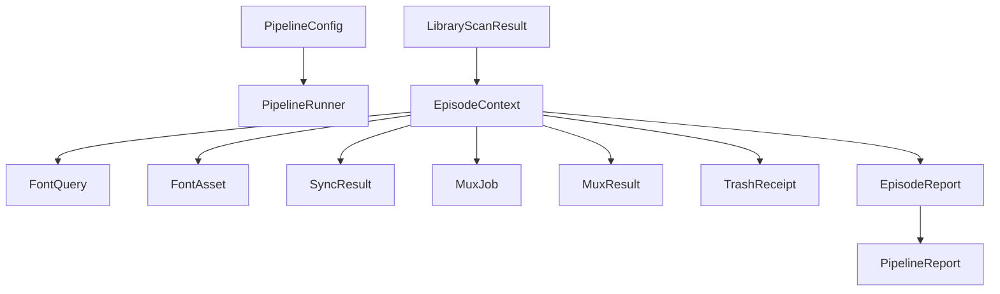

# Data Model: Pipeline Orchestration

**Feature**: 004-pipeline | **Date**: 2026-05-26

## New Entities

### LibraryScanResult

**Module**: `src/models/pipeline.py`

Represents a single discovered MKV/ASS pair from a directory scan.

| Field | Type | Constraints | Notes |
|-------|------|-------------|-------|
| `episode_path` | `SerializablePath` | required | Absolute path to MKV file |
| `subtitle_path` | `SerializablePath` | required | Absolute path to matching ASS file |
| `anime_title` | `str` | min_length=1 | Derived from parent directory name |

**Config**: `frozen=True`

---

### EpisodeContext

**Module**: `src/models/pipeline.py`

Aggregates all intermediate results for one episode during pipeline execution.

| Field | Type | Constraints | Notes |
|-------|------|-------------|-------|
| `scan_result` | `LibraryScanResult` | required | Source MKV/ASS pair |
| `repaired_content` | `str \| None` | default=None | ASS content after repair |
| `font_queries` | `list[FontQuery]` | default=[] | Extracted font references |
| `resolved_fonts` | `list[FontAsset]` | default=[] | Successfully resolved fonts |
| `missing_fonts` | `list[str]` | default=[] | Font names that could not be resolved |
| `sync_result` | `SyncResult \| None` | default=None | Subtitle sync outcome |
| `mux_job` | `MuxJob \| None` | default=None | Planned mux operation |
| `mux_result` | `MuxResult \| None` | default=None | Mux execution outcome |
| `trash_receipts` | `list[TrashReceipt]` | default=[] | Receipts for displaced originals |
| `status` | `EpisodeStatus` | default=FAILED | Final episode status |
| `errors` | `list[str]` | default=[] | Error messages collected during processing |

**Config**: `frozen=True` — mutations via `model_copy(update={...})`

**Note**: EpisodeContext is NOT frozen in the traditional sense during pipeline processing. Since it accumulates results from multiple stages, each stage produces a new EpisodeContext via `model_copy()`. The frozen config ensures immutability of each snapshot.

---

### PipelineConfig

**Module**: `src/models/pipeline.py`

Runtime configuration for a pipeline run.

| Field | Type | Constraints | Notes |
|-------|------|-------------|-------|
| `library_path` | `SerializablePath` | required | Root directory to scan |
| `dry_run` | `bool` | default=False | Skip all file mutations |
| `sync_enabled` | `bool` | default=False | Enable subtitle sync via alass/ffsubsync |
| `anime_title` | `str \| None` | default=None | Override auto-detected title |

**Config**: `frozen=True`

## Existing Entities (referenced, not modified)

| Entity | Module | Used For |
|--------|--------|----------|
| `SubtitleFile` | `src/models/subtitle.py` | ASS file metadata after repair |
| `FontQuery` | `src/models/font.py` | Font resolution requests |
| `FontAsset` | `src/models/font.py` | Resolved font files |
| `MuxJob` | `src/models/mux.py` | Mux operation planning |
| `MuxResult` | `src/models/mux.py` | Mux execution outcome |
| `TrashReceipt` | `src/models/trash.py` | Trash tracking |
| `ToolResult` | `src/models/tool_result.py` | Subprocess execution outcome |
| `EpisodeReport` | `src/models/report.py` | Per-episode report data |
| `PipelineReport` | `src/models/report.py` | Aggregate pipeline report |
| `SyncResult` | `src/models/subtitle.py` | Subtitle sync outcome |
| `EpisodeStatus` | `src/models/report.py` | Episode status enum |

## Relationships



## State Transitions

EpisodeContext flows through pipeline stages:

```
SCAN → REPAIR → FONT_RESOLVE → [SYNC] → MUX_PLAN → MUX_EXECUTE → TRASH → REPORT
```

Each stage produces a new frozen EpisodeContext snapshot via `model_copy()`.

Episode status determination:
- All fonts found + mux success → `COMPLETE` (✓)
- Some fonts missing but mux success → `PARTIAL` (⚠)
- Repair or mux failure → `FAILED` (✗)
- No matching ASS file → `SKIPPED`
