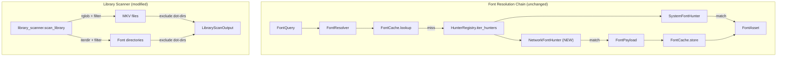

# Data Model: Hotfix — Core Stability & Hunter Resolution (v1.7.0)

**Generated**: 2026-05-27 | **Status**: Complete

## Overview

This hotfix modifies **no data models**. All existing domain models remain structurally unchanged.
The only model-adjacent changes are:

1. A new `google_fonts_api_key` field on `AppConfig` (configuration, not domain model)
2. New internal constants in `SystemFontHunter` for normalization (private, not exposed)

## Existing Models (Unchanged)

### FontQuery

```python
# src/models/font.py — NO CHANGES
class FontQuery(BaseModel):
    model_config = ConfigDict(frozen=True)
    requested_name: str
    anime_title: str
    episode_path: SerializablePath
```

### FontAsset

```python
# src/models/font.py — NO CHANGES
class FontAsset(BaseModel):
    model_config = ConfigDict(frozen=True)
    name: str
    file_path: SerializablePath
    source: str
    layer_found: int
    cache_hit: bool
    nameids: dict[int, str] = {}
    is_cacheable: bool = True
    is_patched: bool = False
    patch_reason: str | None = None
```

### HunterResult

```python
# src/models/font.py — NO CHANGES
class HunterResult(BaseModel):
    model_config = ConfigDict(frozen=True)
    query: FontQuery
    font_asset: FontAsset | None = None
    success: bool
    hunter_name: str
    duration_ms: float
    attempts: int = 1
```

### LibraryScanOutput

```python
# src/models/pipeline.py — NO CHANGES
class LibraryScanOutput(BaseModel):
    model_config = ConfigDict(frozen=True)
    episodes: list[LibraryScanResult]
    font_directories: list[SerializablePath]
```

## Configuration Model Extension

### AppConfig

```python
# src/config.py — ADDITIVE CHANGE ONLY
class AppConfig(BaseModel):
    # ... existing fields unchanged ...
    proxy: str | None = None
    circuit_breaker_cooldown_s: float = Field(default=60.0, ge=0.0)
    startup_ping_timeout_s: float = Field(default=2.0, ge=0.0)
    # NEW FIELD:
    google_fonts_api_key: str | None = None  # Required for NetworkFontHunter
```

## Internal Types (New, Not Domain Models)

### SystemFontHunter Normalization Constants

```python
# src/hunters/system_font_hunter.py — module-level constants
FONT_EXTENSIONS: frozenset[str] = frozenset({".ttf", ".otf", ".ttc"})

STRIP_SUFFIXES: frozenset[str] = frozenset({
    "regular", "normal", "book", "roman", "plain", "standard",
    "medium", "text", "display",
})

WEIGHT_SYNONYMS: dict[str, set[str]] = {
    "semibold": {"demibold", "demi bold", "semi bold"},
    "bold": {"heavy", "black", "dark"},
    "light": {"thin", "hairline", "ultralight", "extra light", "extralight"},
    "extrabold": {"ultra bold", "ultrabold", "extra bold"},
}
```

## Entity Relationships



## State Transitions

### Circuit Breaker (unchanged behavior, softer ping trigger)

```mermaid
stateDiagram-v2
    [*] --> CLOSED
    CLOSED --> OPEN: threshold consecutive failures
    OPEN --> HALF_OPEN: cooldown_s elapsed
    HALF_OPEN --> CLOSED: success
    HALF_OPEN --> OPEN: failure

    note right of CLOSED: Startup ping: 1 failure recorded (was: threshold failures)
```
