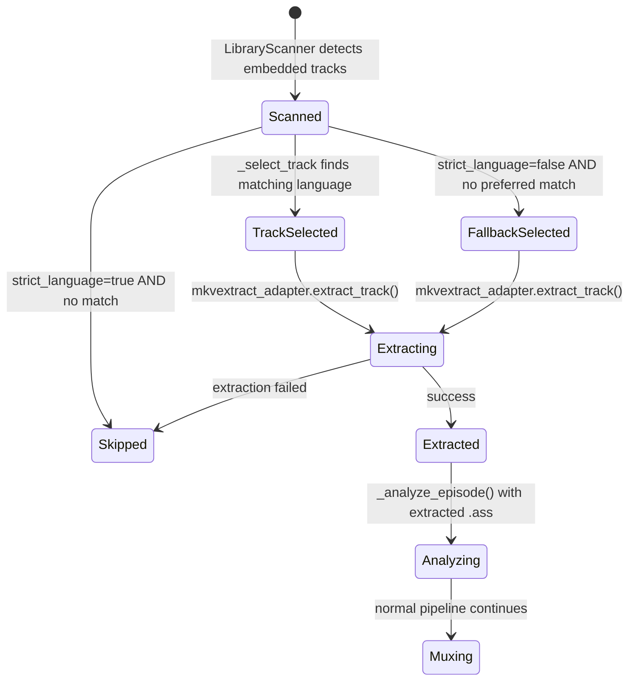

# Data Model: Embedded Subtitle Extraction

**Feature**: Embedded Subtitle Extraction via mkvextract
**Date**: 2026-05-27

## Entities

### EmbeddedTrack (NEW)

One embedded ASS/SSA subtitle track inside an MKV container.

| Field | Type | Default | Validation | Description |
|-------|------|---------|------------|-------------|
| `track_id` | `int` | — | `ge=0` | 0-based track ID from mkvmerge -J `"id"` field |
| `language` | `str` | `""` | — | ISO 639-2/B language code (e.g., `"ara"`, `"eng"`) |
| `language_ietf` | `str` | `""` | — | BCP 47 language tag (e.g., `"ar"`, `"en"`) |
| `is_default` | `bool` | `False` | — | Whether this track is the default subtitle track |
| `codec` | `str` | `""` | — | Codec name (e.g., `"SubStationAlpha"`) |

**Location**: `src/models/pipeline.py`
**Frozen**: Yes (`ConfigDict(frozen=True)`)

### EmbeddedSubInfo (MODIFIED)

Metadata about all embedded ASS subtitle tracks inside an MKV container.

| Field | Type | Default | Validation | Description |
|-------|------|---------|------------|-------------|
| `tracks` | `list[EmbeddedTrack]` | `[]` | — | Ordered list of embedded ASS/SSA tracks |
| `has_embedded_fonts` | `bool` | `False` | — | Whether the MKV has font attachments |
| `embedded_font_names` | `list[str]` | `[]` | — | Sorted list of embedded font file names |

**Computed properties**:
- `track_count: int` → `len(self.tracks)` (replaces former field)
- `languages: list[str]` → `[t.language for t in self.tracks if t.language]` (replaces former field)

**Breaking changes**: Constructors using `EmbeddedSubInfo(track_count=N, languages=[...])` must migrate to `EmbeddedSubInfo(tracks=[EmbeddedTrack(...), ...])`.

### SubtitleConfig (NEW)

Subtitle extraction configuration.

| Field | Type | Default | Validation | Description |
|-------|------|---------|------------|-------------|
| `preferred_language` | `str` | `"ara"` | — | ISO 639-2/B language code for preferred embedded subtitle track |
| `strict_language` | `bool` | `True` | — | If true, skip episodes without matching language track |

**Location**: `src/config.py`
**Nested under**: `AppConfig.subtitle`

### AppConfig (MODIFIED)

| Field | Type | Default | Description |
|-------|------|---------|-------------|
| `subtitle` | `SubtitleConfig` | `SubtitleConfig()` | Subtitle extraction preferences |

### PipelineRunner (MODIFIED constructor)

| Parameter | Type | Default | Description |
|-----------|------|---------|-------------|
| `mkvextract_adapter` | `MkvextractPort \| None` | `None` | Optional mkvextract port for embedded extraction |

## Relationships

```mermaid
erDiagram
    LibraryScanResult ||--o| EmbeddedSubInfo : "has optional"
    EmbeddedSubInfo ||--|{ EmbeddedTrack : "contains"
    PipelineRunner ||--o| MkvextractPort : "uses optional"
    PipelineRunner ||--|| AppConfig : "reads"
    AppConfig ||--|| SubtitleConfig : "contains"
    MkvextractAdapter ..|> MkvextractPort : "implements"
    MkvextractAdapter ||--|| SubprocessPort : "delegates to"
```

## State Transitions


