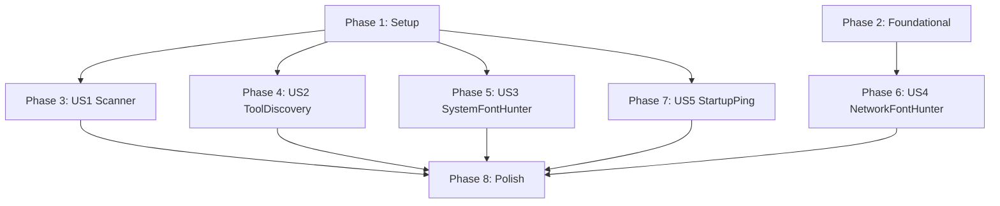

# Tasks: Hotfix — Core Stability & Hunter Resolution (v1.7.0)

**Input**: Design documents from `specs/007-font-ingestion/`

**Prerequisites**: plan.md ✅, spec.md ✅, research.md ✅, data-model.md ✅, quickstart.md ✅

**Tests**: Included — spec.md mandates test-first discipline (Constitution X) and the plan's verification section specifies unit, contract, and integration tests.

**Organization**: Tasks are grouped by bug cluster (mapped to user stories from spec). Each cluster is independently fixable and testable.

## Format: `[ID] [P?] [Story] Description`

- **[P]**: Can run in parallel (different files, no dependencies)
- **[Story]**: Which user story this task belongs to (US1=Scanner, US2=ToolDiscovery, US3=SystemFontHunter, US4=NetworkFontHunter, US5=StartupPing)
- Include exact file paths in descriptions

## Story Mapping

| Story | Hotfix Component | Spec User Stories Affected | Priority |
|-------|-----------------|---------------------------|----------|
| US1 | Scanner Trash Exclusion | US2 (Auto-Discovery), US5 (Feedback) | P0 (blocker) |
| US2 | Tool Discovery Logging | All (pipeline prerequisite) | P1 |
| US3 | SystemFontHunter Normalization + TTC | US1 (System Font Resolution) | P0 (blocker) |
| US4 | NetworkFontHunter Creation | US1 (System Font Resolution fallback) | P1 |
| US5 | Startup Ping Proxy + Circuit Breaker | US1 (System Font Resolution), US4 (Network) | P0 (blocker) |

---

## Phase 1: Setup

**Purpose**: No new project setup needed — all files exist. Verify baseline.

- [ ] T001 Run existing test suite to establish baseline with `pytest tests/ -v --tb=short`
- [ ] T002 Verify current scanner behavior by reviewing `src/core/library_scanner.py` scan output with a library containing `.anime_studio_trash/`

**Checkpoint**: Baseline established — all existing tests pass, bug behaviors confirmed.

---

## Phase 2: Foundational (Blocking Prerequisites)

**Purpose**: Configuration extension needed before US4 (NetworkFontHunter) can be implemented.

**⚠️ CRITICAL**: T003 must complete before Phase 6 (US4) can begin.

- [ ] T003 Add `google_fonts_api_key: str | None = None` field to `AppConfig` in `src/config.py`
- [ ] T004 [P] Add unit test for new config field in `tests/unit/test_config.py` — verify default is `None`, verify TOML round-trip with key present and absent

**Checkpoint**: Config extended — NetworkFontHunter can be wired up in Phase 6.

---

## Phase 3: User Story 1 — Scanner Trash Exclusion (Priority: P0) 🎯 MVP

**Goal**: Prevent `library_scanner.scan_library()` from recursively processing `.anime_studio_trash/`, `.git/`, and any dot-prefixed directory.

**Independent Test**: Create temp dir with `library/show/.anime_studio_trash/ep01.mkv`, `library/show/ep01.mkv`, and `library/.git/config.mkv`. Run `scan_library()` on `library/`. Assert only `library/show/ep01.mkv` appears in results. Assert `.anime_studio_trash` and `.git` contents are excluded.

### Tests for User Story 1

- [ ] T005 [P] [US1] Create/update unit test in `tests/unit/core/test_library_scanner.py` — test `_is_excluded()` helper returns `True` for paths containing `.anime_studio_trash`, `.git`, `.vscode` components and `False` for normal paths
- [ ] T006 [P] [US1] Create/update unit test in `tests/unit/core/test_library_scanner.py` — test `scan_library()` excludes MKV files inside `.anime_studio_trash/` from `episodes` list in scan result
- [ ] T007 [P] [US1] Create/update unit test in `tests/unit/core/test_library_scanner.py` — test `scan_library()` excludes font directories inside dot-prefixed directories from `font_directories` list in scan result

### Implementation for User Story 1

- [ ] T008 [US1] Add `_is_excluded(path: Path, base: Path) -> bool` helper function to `src/core/library_scanner.py` — checks if any path component relative to `base` starts with `.`
- [ ] T009 [US1] Apply `_is_excluded()` filter to `rglob("*.mkv")` results on line 24 of `src/core/library_scanner.py` — filter before sorting
- [ ] T010 [US1] Apply `_is_excluded()` filter to font directory discovery in `src/core/library_scanner.py` — exclude `child` dirs whose resolved path passes through a dot-prefixed ancestor
- [ ] T011 [US1] Run `tests/unit/core/test_library_scanner.py -v` and verify all new tests pass

**Checkpoint**: Scanner no longer processes trashed files. Infinite reprocessing loop eliminated.

---

## Phase 4: User Story 2 — Tool Discovery Diagnostic Logging (Priority: P1)

**Goal**: Add per-step `DEBUG`-level logging to `DependencyChecker.discover_one()` so users can diagnose tool discovery failures from logs alone.

**Independent Test**: Mock `Path.is_file()` to return `False` for all 5 discovery steps for `alass`. Run `discover_all()`. Assert DEBUG log output contains all 5 checked paths. Assert final `WARNING` log for missing optional tool.

### Tests for User Story 2

- [ ] T012 [P] [US2] Create/update unit test in `tests/unit/adapters/test_dependency_checker.py` — test that `discover_one()` emits exactly 5 DEBUG log entries on Windows when tool not found (one per discovery step with path and exists status)
- [ ] T013 [P] [US2] Create/update unit test in `tests/unit/adapters/test_dependency_checker.py` — test that `discover_one()` emits summary INFO log when tool is found, including resolved path and which step succeeded

### Implementation for User Story 2

- [ ] T014 [US2] Add `logger.debug()` call at each of the 5 discovery steps in `DependencyChecker.discover_one()` in `src/adapters/dependency_checker.py` — each log must include `tool=spec.name`, `step=N`, `path=str(checked_path)`, `exists=bool`
- [ ] T015 [US2] Add summary `logger.info()` call at end of `discover_one()` in `src/adapters/dependency_checker.py` — log resolved path and step number when found, or all checked paths when not found
- [ ] T016 [US2] Run `tests/unit/adapters/test_dependency_checker.py -v` and verify all new tests pass

**Checkpoint**: Tool discovery is now fully diagnosable from logs. Zero behavioral change.

---

## Phase 5: User Story 3 — SystemFontHunter Normalization & TTC (Priority: P0) 🎯 MVP

**Goal**: Fix `SystemFontHunter` to (a) scan `.ttc` TrueType Collection files and (b) apply progressive name normalization when exact match fails.

**Independent Test**: Create mock font index with entries like `"arial regular"`, `"segoe ui semibold"`. Query `"Arial"` → assert match via suffix stripping. Query `"Segoe UI Demi Bold"` → assert match via weight synonym. Create mock `.ttc` file with 2 fonts → assert both are indexed.

### Tests for User Story 3

- [ ] T017 [P] [US3] Create/update unit test in `tests/unit/hunters/test_system_font_hunter.py` — test exact match still works (fast path): query `"arial"` when index has `"arial"` → match
- [ ] T018 [P] [US3] Create/update unit test in `tests/unit/hunters/test_system_font_hunter.py` — test suffix stripping: query `"Arial"` when index has `"arial regular"` → match via stripping `"regular"`
- [ ] T019 [P] [US3] Create/update unit test in `tests/unit/hunters/test_system_font_hunter.py` — test suffix appending: query `"Arial Regular"` when index has `"arial regular"` → exact match; query `"Arial"` when only `"arial regular"` exists → match via append
- [ ] T020 [P] [US3] Create/update unit test in `tests/unit/hunters/test_system_font_hunter.py` — test weight synonym expansion: query `"Segoe UI Demi Bold"` when index has `"segoe ui semibold"` → match; query `"MyFont Heavy"` when index has `"myfont bold"` → match
- [ ] T021 [P] [US3] Create/update unit test in `tests/unit/hunters/test_system_font_hunter.py` — test `.ttc` extension is accepted in `_build_index()` — mock filesystem with `.ttc` file, verify fonts are indexed
- [ ] T022 [P] [US3] Create/update unit test in `tests/unit/hunters/test_system_font_hunter.py` — test no false positives: query `"Times New Roman"` when index has `"arial"` → no match returned

### Implementation for User Story 3

- [ ] T023 [US3] Add normalization constants to `src/hunters/system_font_hunter.py` — `FONT_EXTENSIONS`, `STRIP_SUFFIXES`, `WEIGHT_SYNONYMS` as module-level `frozenset`/`dict`
- [ ] T024 [US3] Update `_build_index()` in `src/hunters/system_font_hunter.py` — change extension filter from `(".ttf", ".otf")` to `FONT_EXTENSIONS` frozenset (add `.ttc`)
- [ ] T025 [US3] Add `.ttc` collection handling in `_build_index()` in `src/hunters/system_font_hunter.py` — for `.ttc` files, iterate `TTCollection.fonts` to extract names from ALL fonts in the collection, with try/except fallback to `fontNumber=0`
- [ ] T026 [US3] Add `_strip_style_suffix(name: str) -> str` private method to `SystemFontHunter` in `src/hunters/system_font_hunter.py` — strips trailing tokens matching `STRIP_SUFFIXES`
- [ ] T027 [US3] Add `_make_result(index_key: str, query: FontQuery) -> HunterResult` helper to `SystemFontHunter` in `src/hunters/system_font_hunter.py` — DRY extraction of the result-building logic from `search()`
- [ ] T028 [US3] Refactor `search()` in `src/hunters/system_font_hunter.py` — replace single exact-match lookup with 4-tier progressive resolution: (1) exact match, (2) strip trailing suffix, (3) append common suffixes, (4) weight synonym expansion
- [ ] T029 [US3] Add normalized keys during `_build_index()` in `src/hunters/system_font_hunter.py` — for each font, also index a version with style suffix stripped (e.g., `"arial regular"` → also index as `"arial"`)
- [ ] T030 [US3] Run `tests/unit/hunters/test_system_font_hunter.py -v` and verify all new tests pass

**Checkpoint**: SystemFontHunter finds Arial, Segoe UI, and variant-named fonts. `.ttc` system fonts are discoverable.

---

## Phase 6: User Story 4 — NetworkFontHunter Creation (Priority: P1)

**Goal**: Create a new `NetworkFontHunter` implementing `HunterProtocol` for Google Fonts API resolution. Gated behind `google_fonts_api_key` config field.

**Independent Test**: Mock Google Fonts API response with `httpx`'s mock transport. Query `"Roboto"` → assert valid `HunterResult` returned. Assert `supports()` returns `False` when API key is `None`.

### Tests for User Story 4

- [ ] T031 [P] [US4] Create unit test in `tests/unit/hunters/test_network_font_hunter.py` — test `supports()` returns `False` when `config.google_fonts_api_key` is `None`
- [ ] T032 [P] [US4] Create unit test in `tests/unit/hunters/test_network_font_hunter.py` — test `supports()` returns `True` when `config.google_fonts_api_key` is set
- [ ] T033 [P] [US4] Create unit test in `tests/unit/hunters/test_network_font_hunter.py` — test `search()` with mocked HTTP response returns valid `HunterResult` with `font_asset` populated
- [ ] T034 [P] [US4] Create unit test in `tests/unit/hunters/test_network_font_hunter.py` — test `search()` returns empty list when font not found in Google Fonts API (404 or empty items)
- [ ] T035 [P] [US4] Create unit test in `tests/unit/hunters/test_network_font_hunter.py` — test `_make_client()` passes `proxy` kwarg when `config.proxy` is set
- [ ] T036 [P] [US4] Create unit test in `tests/unit/hunters/test_network_font_hunter.py` — test `download()` returns valid `FontPayload` with font bytes from mocked HTTP response
- [ ] T037 [P] [US4] Create contract test in `tests/contract/test_hunter_protocol.py` — verify `NetworkFontHunter` satisfies `HunterProtocol` (`isinstance` check with `@runtime_checkable`)

### Implementation for User Story 4

- [ ] T038 [US4] Create `src/hunters/network_font_hunter.py` — implement `NetworkFontHunter` class with attributes: `name="GoogleFontsHunter"`, `priority=6`, `rate_limit=0.5`, `circuit_breaker_threshold=3`, `ping_url="https://fonts.google.com"`
- [ ] T039 [US4] Implement `__init__(self, config: AppConfig)` in `src/hunters/network_font_hunter.py` — store config reference
- [ ] T040 [US4] Implement `_make_client(self) -> httpx.AsyncClient` in `src/hunters/network_font_hunter.py` — create client with `timeout=10.0` and `proxy=self._config.proxy` when set
- [ ] T041 [US4] Implement `supports(self, query: FontQuery) -> bool` in `src/hunters/network_font_hunter.py` — return `True` only when `self._config.google_fonts_api_key` is not `None`
- [ ] T042 [US4] Implement `search(self, query: FontQuery) -> list[HunterResult]` in `src/hunters/network_font_hunter.py` — query Google Fonts API at `https://www.googleapis.com/webfonts/v1/webfonts`, filter by family name, return `HunterResult` with `FontAsset` containing download URL
- [ ] T043 [US4] Implement `download(self, result: HunterResult) -> FontPayload` in `src/hunters/network_font_hunter.py` — download font file bytes from URL in `result.font_asset.file_path`, return `FontPayload` with font data, name, and extension
- [ ] T044 [US4] Update `src/hunters/__init__.py` — add `NetworkFontHunter` to exports
- [ ] T045 [US4] Run `tests/unit/hunters/test_network_font_hunter.py -v` and `tests/contract/test_hunter_protocol.py -v` — verify all new tests pass

**Checkpoint**: Network font resolution available via Google Fonts API. Fully optional — disabled when API key absent.

---

## Phase 7: User Story 5 — Startup Ping Proxy & Circuit Breaker Fix (Priority: P0) 🎯 MVP

**Goal**: Fix `FontResolver.startup_ping()` to inject `config.proxy` into `httpx.AsyncClient` and reduce ping failure severity from force-trip to single failure record.

**Independent Test**: Create `FontResolver` with `config.proxy = "socks5://127.0.0.1:1080"`. Call `startup_ping()` with mocked hunters. Assert `httpx.AsyncClient` was created with `proxy` kwarg. Simulate single ping failure → assert circuit breaker has exactly 1 failure (not 3).

### Tests for User Story 5

- [ ] T046 [P] [US5] Create/update unit test in `tests/unit/core/test_font_resolver.py` — test `startup_ping()` creates `httpx.AsyncClient` with `proxy` kwarg when `config.proxy` is set
- [ ] T047 [P] [US5] Create/update unit test in `tests/unit/core/test_font_resolver.py` — test `startup_ping()` creates `httpx.AsyncClient` without `proxy` kwarg when `config.proxy` is `None`
- [ ] T048 [P] [US5] Create/update unit test in `tests/unit/core/test_font_resolver.py` — test `_ping_hunter()` records exactly 1 failure on ping failure (not `circuit_breaker_threshold` failures)
- [ ] T049 [P] [US5] Create/update unit test in `tests/unit/core/test_font_resolver.py` — test circuit breaker remains in CLOSED state after single ping failure (threshold is 3, only 1 failure recorded)

### Implementation for User Story 5

- [ ] T050 [US5] Modify `startup_ping()` in `src/core/font_resolver.py` — build `client_kwargs` dict, conditionally add `proxy=self.config.proxy`, pass to `httpx.AsyncClient(**client_kwargs)`
- [ ] T051 [US5] Modify `_ping_hunter()` in `src/core/font_resolver.py` — replace the force-trip loop (`for _ in range(threshold): cb.record_failure()`) with a single `cb.record_failure()` call
- [ ] T052 [US5] Update warning log message in `_ping_hunter()` in `src/core/font_resolver.py` — change from "Opening circuit breaker" to "Hunter will still be attempted during resolution" to reflect softer behavior
- [ ] T053 [US5] Run `tests/unit/core/test_font_resolver.py -v` and verify all new tests pass

**Checkpoint**: Proxy users can reach network font sources. Single ping failure doesn't permanently disable hunters.

---

## Phase 8: Polish & Cross-Cutting Concerns

**Purpose**: Final validation across all hotfix components.

- [ ] T054 [P] Run full test suite with `pytest tests/ -v --tb=short` — verify zero regressions
- [ ] T055 [P] Run `ruff check src/core/library_scanner.py src/adapters/dependency_checker.py src/hunters/ src/core/font_resolver.py src/config.py` — verify zero lint warnings
- [ ] T056 [P] Run `ruff format --check src/core/library_scanner.py src/adapters/dependency_checker.py src/hunters/ src/core/font_resolver.py src/config.py` — verify formatting
- [ ] T057 Verify scanner exclusion end-to-end: create temp library with `.anime_studio_trash/` containing MKV files, run `scan_library()`, confirm excluded
- [ ] T058 Verify font resolution end-to-end: run `SystemFontHunter.search()` against real system fonts (Arial, Segoe UI on Windows), confirm matches found
- [ ] T059 Review all `structlog` log output for new/modified operations — confirm DEBUG/INFO/WARNING levels are appropriate per Constitution IX
- [ ] T060 Run quickstart.md verification commands from `specs/007-font-ingestion/quickstart.md`

---

## Dependencies & Execution Order

### Phase Dependencies

- **Setup (Phase 1)**: No dependencies — start immediately
- **Foundational (Phase 2)**: No dependencies — can run in parallel with Phase 1
- **US1 Scanner (Phase 3)**: No dependencies on other stories — can start after Phase 1 baseline
- **US2 ToolDiscovery (Phase 4)**: No dependencies on other stories — can start after Phase 1 baseline
- **US3 SystemFontHunter (Phase 5)**: No dependencies on other stories — can start after Phase 1 baseline
- **US4 NetworkFontHunter (Phase 6)**: Depends on **Phase 2** (T003 config extension)
- **US5 StartupPing (Phase 7)**: No dependencies on other stories — can start after Phase 1 baseline
- **Polish (Phase 8)**: Depends on ALL previous phases

### User Story Dependencies



### Within Each User Story

- Tests MUST be written and FAIL before implementation
- Implementation follows plan.md's proposed changes
- Story complete before moving to Polish

### Parallel Opportunities

- **Phase 3, 4, 5, 7** (US1, US2, US3, US5) can ALL run in parallel — they modify different files with zero overlap
- **Phase 6** (US4) can run in parallel with Phases 3, 4, 5, 7 once Phase 2 (T003) is done
- All test tasks within a story marked `[P]` can run in parallel
- Within Phase 8, all `[P]` tasks can run in parallel

---

## Parallel Example: All MVP Stories

```bash
# After Phase 1 baseline is confirmed, launch all P0 stories simultaneously:

# Agent A: Scanner fix
Task: "T005-T011 — Scanner trash exclusion in src/core/library_scanner.py"

# Agent B: SystemFontHunter normalization
Task: "T017-T030 — Font normalization + TTC in src/hunters/system_font_hunter.py"

# Agent C: Startup ping fix
Task: "T046-T053 — Proxy injection + soft CB in src/core/font_resolver.py"

# Agent D: Tool discovery logging
Task: "T012-T016 — Diagnostic logging in src/adapters/dependency_checker.py"
```

---

## Implementation Strategy

### MVP First (P0 Blockers Only)

1. Complete Phase 1: Setup (T001-T002)
2. Complete Phase 3: US1 Scanner (T005-T011) — eliminates trash loop
3. Complete Phase 5: US3 SystemFontHunter (T017-T030) — fixes font resolution
4. Complete Phase 7: US5 StartupPing (T046-T053) — fixes proxy/CB
5. **STOP and VALIDATE**: Run full test suite, verify all 3 critical bugs resolved
6. Ship hotfix

### Full Delivery

1. MVP above → verify
2. Add Phase 2 + Phase 6: US4 NetworkFontHunter → test independently
3. Add Phase 4: US2 ToolDiscovery logging → test independently
4. Complete Phase 8: Polish → full validation
5. Ship complete hotfix

### Incremental Delivery

Each story adds value independently:
- **US1 alone**: No more infinite reprocessing loops
- **US3 alone**: System fonts (Arial, Segoe, CJK) now resolve correctly
- **US5 alone**: Proxy users get working network resolution
- **US4 alone**: Google Fonts API provides network font fallback
- **US2 alone**: Tool discovery failures become diagnosable

---

## Notes

- [P] tasks = different files, no dependencies
- [Story] label maps task to specific user story for traceability
- Each user story is independently completable and testable
- Verify tests fail before implementing
- Commit after each task or logical group
- Stop at any checkpoint to validate story independently
- File overlap analysis: **zero overlap** between stories — each modifies a unique file
