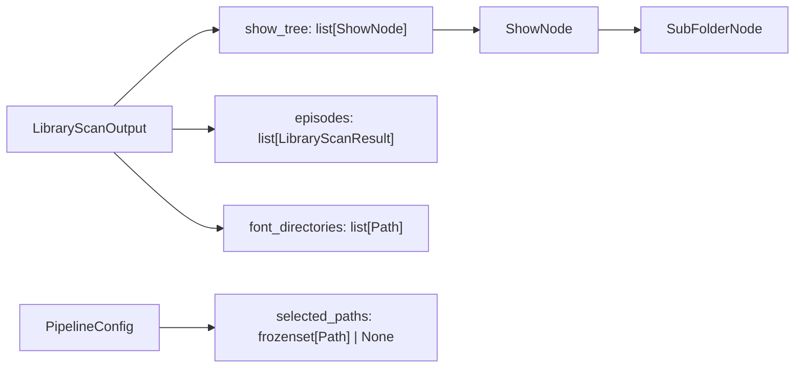

# Data Model: Pre-Packaging UX (Phase 7)

**Date**: 2026-06-06

## New Models

### SubFolderNode

**Location**: `src/models/pipeline.py`
**Type**: Pydantic `BaseModel` (frozen)

| Field | Type | Constraints | Description |
|-------|------|-------------|-------------|
| `name` | `str` | `min_length=1` | Display name of the sub-folder (e.g. "Season 1") |
| `path` | `SerializablePath` | Required | Resolved absolute path to the sub-folder |
| `episode_count` | `int` | `ge=0, default=0` | Number of processable episodes (MKVs with matching subs) |

### ShowNode

**Location**: `src/models/pipeline.py`
**Type**: Pydantic `BaseModel` (frozen)

| Field | Type | Constraints | Description |
|-------|------|-------------|-------------|
| `name` | `str` | `min_length=1` | Display name of the show (e.g. "Hunter x Hunter") |
| `path` | `SerializablePath` | Required | Resolved absolute path to the show folder |
| `sub_folders` | `list[SubFolderNode]` | `default_factory=list` | Child folders (seasons, movies, OVAs) |
| `direct_episode_count` | `int` | `ge=0, default=0` | Episodes directly in show folder (not in sub-folders) |

### Relationships

## Modified Models

### LibraryScanOutput

**Added field**:

| Field | Type | Constraints | Description |
|-------|------|-------------|-------------|
| `show_tree` | `list[ShowNode]` | `default_factory=list` | Hierarchical tree of shows and sub-folders for GUI display |

**Backward compatibility**: Defaults to empty list. Existing code that only reads `episodes` and `font_directories` is unaffected.

### PipelineConfig

**Added field**:

| Field | Type | Constraints | Description |
|-------|------|-------------|-------------|
| `selected_paths` | `frozenset[SerializablePath] \| None` | `default=None` | Paths of selected folders. `None` = process all (default). |

**Backward compatibility**: Defaults to `None`. Existing callers that don't pass `selected_paths` get unchanged behavior.

## Validation Rules

- `ShowNode.name` and `SubFolderNode.name` must be non-empty (derived from directory name)
- `episode_count` and `direct_episode_count` must be >= 0
- All paths must be absolute (enforced by `SerializablePath` resolver)
- `selected_paths` items must be absolute paths corresponding to actual scanned directories

## State Transitions

No state machines in the data model layer. Selection state is GUI-only (not persisted).
