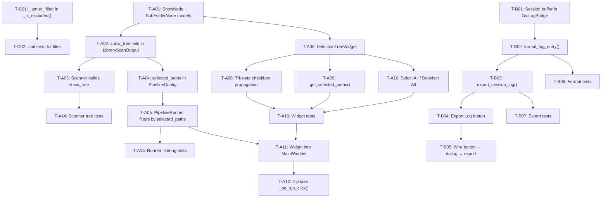

# Implementation Plan: Pre-Packaging UX (Phase 7)

**Branch**: `009-pre-packaging-ux` | **Date**: 2026-06-06 | **Spec**: [spec.md](file:///d:/Dev/projects/Anime_studio/specs/009-pre-packaging-ux/spec.md)

**Input**: Feature specification from `specs/009-pre-packaging-ux/spec.md`

## Summary

Three sub-features for pre-packaging UX polish:

1. **Selective Run (Tree View)** — After library scan, show a QTreeWidget with tri-state checkboxes representing the show/sub-folder hierarchy. User checks/unchecks folders. Pipeline processes only selected paths.
2. **Export Log File** — Button near ActivityFeed exports current session logs to a user-chosen plain-text file via `asyncio.to_thread()`.
3. **Scanner Temp File Fix** — `_is_excluded()` filter rejects `_amux_*.tmp.*` files.

## Technical Context

**Language/Version**: Python 3.11+

**Primary Dependencies**: PySide6 (>=6.6,<6.8), qasync, structlog, Pydantic v2

**Storage**: N/A (no new persistence — selection state is GUI-only, log export is one-shot write)

**Testing**: pytest + pytest-asyncio (231 existing tests)

**Target Platform**: Windows-first (cross-platform via PySide6)

**Project Type**: Desktop app (PySide6 GUI + async pipeline)

**Performance Goals**: Tree renders <500ms for 500 shows; log export <2s for 1000 entries

**Constraints**: No new dependencies; no business logic in GUI; `pathlib.Path` everywhere; `asyncio.to_thread()` for blocking I/O

**Scale/Scope**: Typical library: 10-100 shows, 1-20 sub-folders each

## Constitution Check

*GATE: Must pass before Phase 0 research. Re-check after Phase 1 design.*

| Gate | Principle | Status | Notes |
|------|-----------|--------|-------|
| No business logic in GUI | §I Hexagonal | ✅ PASS | Selection tree is pure presentation; path filtering is in `PipelineRunner` (core/) |
| No `asyncio.Queue` for Qt UI | §Forbidden | ✅ PASS | `GuiLogBridge` uses `QtCore.Signal(dict)` — unchanged |
| `pathlib.Path` everywhere | §II Cross-Platform | ✅ PASS | `selected_paths: set[Path]`, all tree paths as `Path` objects |
| `asyncio.to_thread()` for file I/O | §III Async-First | ✅ PASS | Log export file write uses `asyncio.to_thread()` |
| No new deps | §XII YAGNI | ✅ PASS | QTreeWidget is built-in PySide6 |
| Semaphore in core/ only | §Forbidden | ✅ PASS | No new semaphores |
| Structured logging | §IX Observability | ✅ PASS | All events use structlog |
| Domain models in models/ | §I Separation | ✅ PASS | `ShowNode`, `SubFolderNode` in `src/models/pipeline.py` |
| Dot-prefixed dirs excluded | §VI Data Safety | ✅ PASS | Existing `_is_excluded()` unchanged; new filter adds temp file pattern |
| Scanner exclusion filter | §VI | ✅ PASS | `_amux_*.tmp.*` added to `_is_excluded()` |

**Gate Result**: ALL PASS — no violations.

## Project Structure

### Documentation (this feature)

```text
specs/009-pre-packaging-ux/
├── spec.md              # Feature specification
├── plan.md              # This file
├── research.md          # Phase 0 output
├── data-model.md        # Phase 1 output
├── quickstart.md        # Phase 1 output
└── checklists/
    └── requirements.md  # Spec quality checklist
```

### Source Code (files touched)

```text
src/
├── models/
│   └── pipeline.py              # [MODIFY] Add ShowNode, SubFolderNode; extend LibraryScanOutput
├── core/
│   ├── library_scanner.py       # [MODIFY] Build show_tree; add _amux_ filter to _is_excluded()
│   └── pipeline_runner.py       # [MODIFY] Filter scan_results by selected_paths
├── gui/
│   ├── main_window.py           # [MODIFY] Integrate SelectionTreeWidget; 2-phase run flow
│   ├── log_bridge.py            # [MODIFY] Add session buffer for export
│   ├── widgets/
│   │   ├── __init__.py          # [MODIFY] Export SelectionTreeWidget
│   │   ├── selection_tree.py    # [NEW] QTreeWidget with tri-state checkboxes
│   │   └── activity_feed.py     # [MODIFY] Add "Export Log" button
│   └── bootstrap.py             # No changes needed

tests/unit/
├── models/
│   └── test_pipeline.py         # [MODIFY] Tests for ShowNode, SubFolderNode
├── core/
│   ├── test_library_scanner.py  # [MODIFY] Tests for show_tree building + _amux_ filter
│   └── test_pipeline_runner.py  # [MODIFY] Tests for selected_paths filtering
└── gui/
    ├── test_selection_tree.py   # [NEW] Widget checkbox propagation tests
    └── test_log_export.py       # [NEW] Format + export tests
```

**Structure Decision**: Follows existing Hexagonal Architecture. New widget in `src/gui/widgets/`. New models in existing `src/models/pipeline.py`. No new directories outside conventions.

---

## Dependency Graph & Execution Order



### Execution Waves

| Wave | Tasks | Parallel? | Description |
|------|-------|-----------|-------------|
| **Wave 0** | T-C01, T-C02 | Sequential | Scanner bug fix — one-line change + tests |
| **Wave 1** | T-A01, T-A02, T-A13 | Sequential | New models + model tests |
| **Wave 2a** | T-A03, T-A04, T-A14 | Sequential | Scanner tree building + PipelineConfig change + tests |
| **Wave 2b** | T-B01, T-B02, T-B06 | Parallel with 2a | Log bridge buffer + format helper + tests |
| **Wave 3a** | T-A05, T-A15 | Sequential | PipelineRunner filtering + tests |
| **Wave 3b** | T-B03, T-B07 | Parallel with 3a | Export function + tests |
| **Wave 4** | T-A06, T-A07, T-A08, T-A09, T-A10, T-A16 | Sequential | SelectionTreeWidget full build + tests |
| **Wave 5** | T-B04, T-B05 | Can overlap Wave 4 | Export Log UI wiring |
| **Wave 6** | T-A11, T-A12 | Sequential (last) | MainWindow integration — depends on everything |

---

## Detailed Component Plans

### Component 1: Scanner Temp File Filter (Wave 0)

#### [MODIFY] [library_scanner.py](file:///d:/Dev/projects/Anime_studio/src/core/library_scanner.py)

**Change**: Extend `_is_excluded()` (line 93-99) to also check filename against `_amux_*.tmp.*` pattern.

```python
import re

_AMUX_TEMP_RE = re.compile(r"^_amux_.*\.tmp\.", re.IGNORECASE)

def _is_excluded(path: Path, base: Path) -> bool:
    """Return True if any path component relative to base starts with '.'
    or if the filename matches the _amux_ temp file pattern."""
    # Existing dot-prefix check
    try:
        relative = path.relative_to(base)
    except ValueError:
        return False
    if any(part.startswith(".") for part in relative.parts):
        return True
    # New: skip _amux_ temp files from interrupted mux operations
    if path.is_file() and _AMUX_TEMP_RE.match(path.name):
        return True
    return False
```

**Note**: Pattern compiled once at module level (O(1) per check). `re.IGNORECASE` for safety. Only checks `path.name` (filename), not full path components.

---

### Component 2: Domain Models (Wave 1)

#### [MODIFY] [pipeline.py](file:///d:/Dev/projects/Anime_studio/src/models/pipeline.py)

**Changes**:

1. Add `ShowNode` and `SubFolderNode` dataclasses:

```python
class SubFolderNode(BaseModel):
    """A sub-folder (season, movie, OVA) within a show directory."""
    model_config = ConfigDict(frozen=True)

    name: str = Field(min_length=1)
    path: SerializablePath
    episode_count: int = Field(ge=0, default=0)


class ShowNode(BaseModel):
    """A top-level show directory in the anime library."""
    model_config = ConfigDict(frozen=True)

    name: str = Field(min_length=1)
    path: SerializablePath
    sub_folders: list[SubFolderNode] = Field(default_factory=list)
    direct_episode_count: int = Field(ge=0, default=0)
```

2. Add `show_tree` to `LibraryScanOutput`:

```python
class LibraryScanOutput(BaseModel):
    model_config = ConfigDict(frozen=True)

    episodes: list[LibraryScanResult]
    font_directories: list[SerializablePath] = Field(default_factory=list)
    show_tree: list[ShowNode] = Field(default_factory=list)  # NEW
```

3. Add `selected_paths` to `PipelineConfig`:

```python
class PipelineConfig(BaseModel):
    model_config = ConfigDict(frozen=True)

    library_path: SerializablePath
    dry_run: bool = False
    sync_enabled: bool = False
    anime_title: str | None = None
    selected_paths: frozenset[SerializablePath] | None = None  # NEW
```

**Design decisions**:
- `frozenset` instead of `set` because `PipelineConfig` is frozen (Pydantic `ConfigDict(frozen=True)`). Mutable `set` not allowed in frozen model.
- `show_tree` defaults to empty list → backward compatible. Existing code that ignores it continues working.
- `ShowNode.direct_episode_count` counts MKVs directly in the show folder (not in sub-folders).

---

### Component 3: Scanner Tree Building (Wave 2a)

#### [MODIFY] [library_scanner.py](file:///d:/Dev/projects/Anime_studio/src/core/library_scanner.py)

**Change**: After `_phase1_walk()` returns, build `show_tree` from directory structure before returning `LibraryScanOutput`.

New private method `_build_show_tree()`:

```python
def _build_show_tree(
    self, lib_path: Path, scan_results: list[LibraryScanResult]
) -> list[ShowNode]:
    """Build hierarchical show tree from library directory structure.

    Counts episodes per folder based on actual scan results (not raw MKV count).
    """
    # Index episode counts by parent directory
    episodes_by_dir: dict[Path, int] = defaultdict(int)
    for ep in scan_results:
        ep_parent = ep.episode_path.parent
        episodes_by_dir[ep_parent] += 1

    show_nodes = []
    # Top-level: direct children of lib_path that are directories
    try:
        top_dirs = sorted(
            [d for d in lib_path.iterdir() if d.is_dir() and not _is_excluded(d, lib_path)],
            key=lambda d: d.name,
        )
    except Exception:
        return []

    for show_dir in top_dirs:
        resolved_show = show_dir.resolve()
        # Sub-folders within this show
        sub_folder_nodes = []
        try:
            sub_dirs = sorted(
                [d for d in show_dir.iterdir() if d.is_dir() and not _is_excluded(d, lib_path)],
                key=lambda d: d.name,
            )
        except Exception:
            sub_dirs = []

        for sub_dir in sub_dirs:
            resolved_sub = sub_dir.resolve()
            count = episodes_by_dir.get(resolved_sub, 0)
            sub_folder_nodes.append(
                SubFolderNode(name=sub_dir.name, path=resolved_sub, episode_count=count)
            )

        direct_count = episodes_by_dir.get(resolved_show, 0)
        show_nodes.append(
            ShowNode(
                name=show_dir.name,
                path=resolved_show,
                sub_folders=sub_folder_nodes,
                direct_episode_count=direct_count,
            )
        )

    return show_nodes
```

**Integration point**: Call from `scan()` after gathering all results:

```python
async def scan(self, library_path: Path) -> LibraryScanOutput:
    # ... existing Phase 1 + Phase 2 code ...
    show_tree = await asyncio.to_thread(self._build_show_tree, lib_path, all_results)
    return LibraryScanOutput(
        episodes=sorted(all_results, key=lambda r: r.episode_path.name),
        font_directories=sorted(list(font_dirs)),
        show_tree=show_tree,
    )
```

**Note**: `_build_show_tree` runs in thread via `asyncio.to_thread()` since it does filesystem `iterdir()` calls.

---

### Component 4: PipelineRunner Filtering (Wave 3a)

#### [MODIFY] [pipeline_runner.py](file:///d:/Dev/projects/Anime_studio/src/core/pipeline_runner.py)

**Change**: After scan, filter `scan_results` by `selected_paths` when not None.

Insert after line 63 (`scan_results = scan_output.episodes`):

```python
# Filter by selected paths if user specified a subset
if pipeline_config.selected_paths is not None:
    selected = pipeline_config.selected_paths
    scan_results = [
        ep for ep in scan_results
        if any(
            ep.episode_path.parent == sel or _is_ancestor(sel, ep.episode_path)
            for sel in selected
        )
    ]
    logger.info(
        f"Filtered to {len(scan_results)} episodes from {len(scan_output.episodes)} total",
        selected_paths_count=len(selected),
    )
```

Helper function (top of module):

```python
def _is_ancestor(ancestor: Path, descendant: Path) -> bool:
    """Check if ancestor is a parent directory of descendant."""
    try:
        descendant.relative_to(ancestor)
        return True
    except ValueError:
        return False
```

**Design decision**: Filter at the earliest point (right after scan) so all downstream code (font ingestion, analysis, muxing) naturally operates on the subset. `_is_ancestor` handles cases where episodes are in sub-sub-folders of selected paths.

---

### Component 5: GuiLogBridge Session Buffer (Wave 2b)

#### [MODIFY] [log_bridge.py](file:///d:/Dev/projects/Anime_studio/src/gui/log_bridge.py)

**Change**: Add a bounded list to store session log entries for export.

```python
class GuiLogBridge(QObject):
    log_received = Signal(dict)

    # Maximum session buffer size (matches ActivityFeed cap)
    MAX_SESSION_BUFFER = 5000

    def __init__(self) -> None:
        super().__init__()
        self._session_buffer: list[dict[str, Any]] = []

    def __call__(self, logger, method_name, event_dict):
        level = str(event_dict.get("level", "debug")).lower()
        if level in ("info", "warning", "error", "critical"):
            event_copy = event_dict.copy()
            event_copy["level"] = level
            self.log_received.emit(event_copy)
            # Store for export (bounded)
            if len(self._session_buffer) < self.MAX_SESSION_BUFFER:
                self._session_buffer.append(event_copy)
        return event_dict

    def get_session_entries(self) -> list[dict[str, Any]]:
        """Return a copy of all session log entries for export."""
        return list(self._session_buffer)
```

**Design decision**: Buffer lives in `GuiLogBridge` (not ActivityFeed) because:
- ActivityFeed is display-only (QPlainTextEdit with 1000-block cap, HTML formatted)
- GuiLogBridge already captures all INFO+ events as structured dicts
- Buffer is raw data, trivially formatted to plain text
- 5000 cap prevents unbounded memory growth (generous enough for any session)

---

### Component 6: Log Export Function (Wave 3b)

New helper functions in a new file or inline in activity_feed.py. Per YAGNI, add as static methods in `ActivityFeedWidget` or as a standalone module. Given clean separation, add to `log_bridge.py`:

#### [MODIFY] [log_bridge.py](file:///d:/Dev/projects/Anime_studio/src/gui/log_bridge.py)

Add format and export helpers:

```python
def format_log_entry(entry: dict[str, Any]) -> str:
    """Format a single log entry as plain text: [HH:MM:SS] [LEVEL] event | key=value ..."""
    timestamp = entry.get("timestamp", "")
    if timestamp and "T" in timestamp:
        try:
            time_part = timestamp.split("T")[1]
            time_str = time_part.split(".")[0].split("+")[0].rstrip("Z")
        except Exception:
            time_str = "??:??:??"
    else:
        time_str = "??:??:??"

    level = str(entry.get("level", "info")).upper()
    event = entry.get("event", "")

    # Collect extra keys (exclude internal structlog keys)
    skip_keys = {"timestamp", "level", "event", "logger", "_record"}
    extras = []
    for k, v in sorted(entry.items()):
        if k not in skip_keys:
            extras.append(f"{k}={v}")

    extra_str = " ".join(extras)
    if extra_str:
        return f"[{time_str}] [{level}] {event} | {extra_str}"
    return f"[{time_str}] [{level}] {event}"


async def export_session_log(entries: list[dict[str, Any]], path: Path) -> None:
    """Write session log entries to a plain text file via asyncio.to_thread()."""
    import asyncio

    def _write():
        lines = [format_log_entry(e) for e in entries]
        header = f"Anime Studio Session Log — {path.stem.split('_')[-1] if '_' in path.stem else 'session'}"
        content = header + "\n" + "=" * len(header) + "\n\n" + "\n".join(lines) + "\n"
        with open(path, "w", encoding="utf-8") as f:
            f.write(content)

    await asyncio.to_thread(_write)
```

---

### Component 7: SelectionTreeWidget (Wave 4)

#### [NEW] [selection_tree.py](file:///d:/Dev/projects/Anime_studio/src/gui/widgets/selection_tree.py)

```python
from pathlib import Path
from PySide6.QtCore import Qt
from PySide6.QtWidgets import (
    QHBoxLayout, QPushButton, QTreeWidget, QTreeWidgetItem,
    QVBoxLayout, QWidget,
)


class SelectionTreeWidget(QWidget):
    """Tree view with tri-state checkboxes for selective library processing."""

    def __init__(self, parent: QWidget | None = None) -> None:
        super().__init__(parent)
        layout = QVBoxLayout(self)
        layout.setContentsMargins(0, 0, 0, 0)

        # Button row
        btn_layout = QHBoxLayout()
        self.select_all_btn = QPushButton("Select All")
        self.deselect_all_btn = QPushButton("Deselect All")
        self.select_all_btn.clicked.connect(self._select_all)
        self.deselect_all_btn.clicked.connect(self._deselect_all)
        btn_layout.addWidget(self.select_all_btn)
        btn_layout.addWidget(self.deselect_all_btn)
        btn_layout.addStretch()
        layout.addLayout(btn_layout)

        # QTreeWidget
        self.tree = QTreeWidget()
        self.tree.setHeaderLabels(["Show / Folder", "Episodes"])
        self.tree.setColumnCount(2)
        self.tree.itemChanged.connect(self._on_item_changed)
        layout.addWidget(self.tree)

    def populate(self, show_tree: list) -> None:
        """Populate tree from list of ShowNode models."""
        self.tree.blockSignals(True)
        self.tree.clear()
        for show in show_tree:
            show_item = QTreeWidgetItem(self.tree)
            show_item.setText(0, show.name)
            show_item.setData(0, Qt.ItemDataRole.UserRole, str(show.path))
            show_item.setFlags(
                show_item.flags()
                | Qt.ItemFlag.ItemIsUserCheckable
                | Qt.ItemFlag.ItemIsAutoTristate
            )
            show_item.setCheckState(0, Qt.CheckState.Checked)

            total_eps = show.direct_episode_count
            if show.sub_folders:
                for sub in show.sub_folders:
                    sub_item = QTreeWidgetItem(show_item)
                    sub_item.setText(0, sub.name)
                    sub_item.setText(1, f"{sub.episode_count} episodes")
                    sub_item.setData(0, Qt.ItemDataRole.UserRole, str(sub.path))
                    sub_item.setFlags(
                        sub_item.flags() | Qt.ItemFlag.ItemIsUserCheckable
                    )
                    sub_item.setCheckState(0, Qt.CheckState.Checked)
                    total_eps += sub.episode_count

            if show.direct_episode_count > 0 and show.sub_folders:
                # Has both direct episodes and sub-folders
                show_item.setText(1, f"{total_eps} episodes ({show.direct_episode_count} direct)")
            else:
                show_item.setText(1, f"{total_eps} episodes")

            show_item.setExpanded(True)

        self.tree.resizeColumnToContents(0)
        self.tree.blockSignals(False)

    def get_selected_paths(self) -> set[Path]:
        """Return paths of all checked leaf/show nodes."""
        paths = set()
        root = self.tree.invisibleRootItem()
        for i in range(root.childCount()):
            show_item = root.child(i)
            if show_item.childCount() == 0:
                # No sub-folders — check show itself
                if show_item.checkState(0) == Qt.CheckState.Checked:
                    paths.add(Path(show_item.data(0, Qt.ItemDataRole.UserRole)))
            else:
                # Has sub-folders — check each child
                for j in range(show_item.childCount()):
                    sub_item = show_item.child(j)
                    if sub_item.checkState(0) == Qt.CheckState.Checked:
                        paths.add(Path(sub_item.data(0, Qt.ItemDataRole.UserRole)))
                # Also include show dir if it has direct episodes and is checked
                show_path_str = show_item.data(0, Qt.ItemDataRole.UserRole)
                if show_path_str:
                    show_path = Path(show_path_str)
                    # Include show dir for direct episodes
                    # (parent check state handles this via tri-state)
                    if show_item.checkState(0) != Qt.CheckState.Unchecked:
                        paths.add(show_path)
        return paths

    def _on_item_changed(self, item: QTreeWidgetItem, column: int) -> None:
        """Qt.ItemFlag.ItemIsAutoTristate handles propagation automatically."""
        # Qt's built-in auto-tristate handles parent/child propagation
        pass

    def _select_all(self) -> None:
        self.tree.blockSignals(True)
        root = self.tree.invisibleRootItem()
        for i in range(root.childCount()):
            self._set_check_recursive(root.child(i), Qt.CheckState.Checked)
        self.tree.blockSignals(False)

    def _deselect_all(self) -> None:
        self.tree.blockSignals(True)
        root = self.tree.invisibleRootItem()
        for i in range(root.childCount()):
            self._set_check_recursive(root.child(i), Qt.CheckState.Unchecked)
        self.tree.blockSignals(False)

    def _set_check_recursive(self, item: QTreeWidgetItem, state: Qt.CheckState) -> None:
        item.setCheckState(0, state)
        for i in range(item.childCount()):
            self._set_check_recursive(item.child(i), state)
```

**Key design decisions**:
- `Qt.ItemFlag.ItemIsAutoTristate` handles parent↔child tri-state propagation automatically — no manual implementation needed.
- `blockSignals(True)` during bulk operations prevents signal storms.
- `get_selected_paths()` returns `set[Path]` — converted to `frozenset` when creating `PipelineConfig`.
- Path stored as `UserRole` data on each tree item.

---

### Component 8: ActivityFeed Export Button (Wave 5)

#### [MODIFY] [activity_feed.py](file:///d:/Dev/projects/Anime_studio/src/gui/widgets/activity_feed.py)

**Change**: Add "Export Log" button to the control row (next to "Clear Feed").

```python
self.export_button = QPushButton("Export Log", self)
self.export_button.clicked.connect(self._on_export_click)
control_layout.addWidget(self.export_button)
```

The click handler emits a signal — actual export logic wired in MainWindow (to access `log_bridge`).

**Alternative chosen**: Add a `Signal()` on `ActivityFeedWidget` that MainWindow connects to the export handler. This keeps the widget presentation-only.

```python
export_requested = Signal()  # class-level

def _on_export_click(self):
    self.export_requested.emit()
```

### Component 9: MainWindow Integration (Wave 6)

#### [MODIFY] [main_window.py](file:///d:/Dev/projects/Anime_studio/src/gui/main_window.py)

**Changes**:

1. **Constructor**: Accept `log_bridge` reference for export. Add `SelectionTreeWidget` to layout (initially hidden). Store log_bridge.

2. **Two-phase run flow** in `_on_run_click()`:

```python
@asyncSlot()
async def _on_run_click(self) -> None:
    library_path = self.library_picker.get_path()
    # ... validation ...

    # Phase 1: Scan
    scan_output = await self.pipeline_runner.library_scanner.scan(Path(library_path))

    if not scan_output.show_tree:
        # No shows found — skip tree, run empty
        pass
    else:
        # Show selection tree
        self.selection_tree.populate(scan_output.show_tree)
        self.selection_tree.setVisible(True)
        self.run_button.setText("Run Pipeline")
        self.run_button.setEnabled(True)
        # Wait for user to click Run again (state machine)
        self._pending_scan_output = scan_output
        self._awaiting_selection = True
        return

    # Phase 2: Execute pipeline with selection
    # (called when run button clicked again with _awaiting_selection=True)
```

**State machine approach**:
- First click: `_on_run_click()` triggers scan → populates tree → stores `_pending_scan_output` → returns.
- Second click: Detects `_awaiting_selection=True` → reads `get_selected_paths()` → creates `PipelineConfig(selected_paths=frozenset(...))` → runs pipeline.
- Tree hidden again after pipeline starts.

3. **Export Log wiring**:

```python
self.activity_feed.export_requested.connect(self._on_export_log)

@asyncSlot()
async def _on_export_log(self) -> None:
    from PySide6.QtWidgets import QFileDialog
    from datetime import date

    default_name = f"anime_studio_log_{date.today().isoformat()}.txt"
    path, _ = QFileDialog.getSaveFileName(
        self, "Export Session Log", default_name, "Text Files (*.txt)"
    )
    if not path:
        return

    entries = self._log_bridge.get_session_entries()
    try:
        from src.gui.log_bridge import export_session_log
        await export_session_log(entries, Path(path))
        self.signal_bridge.log_received.emit({
            "event": f"Log exported to {path}",
            "level": "info",
            "timestamp": "",
        })
    except Exception as e:
        self.signal_bridge.log_received.emit({
            "event": f"Log export failed: {e}",
            "level": "error",
            "timestamp": "",
        })
```

---

## Verification Plan

### Automated Tests

```bash
# Run all unit tests (existing + new)
uv run pytest tests/unit/ -v

# Run specific new test files
uv run pytest tests/unit/models/test_pipeline.py -v -k "ShowNode or SubFolderNode"
uv run pytest tests/unit/core/test_library_scanner.py -v -k "show_tree or amux"
uv run pytest tests/unit/core/test_pipeline_runner.py -v -k "selected_paths"
uv run pytest tests/unit/gui/test_selection_tree.py -v
uv run pytest tests/unit/gui/test_log_export.py -v
```

### Manual Verification

1. **Scanner bug fix**: Place `_amux_test.tmp.mkv` in test library → run scan → verify not in results.
2. **Selection tree**: Point at library with 3+ shows → verify tree appears → uncheck one show → run → verify skipped.
3. **Export log**: Run pipeline → click "Export Log" → verify file contents are human-readable.
4. **Backward compatibility**: Run pipeline without using tree (select all) → verify behavior identical to before.

### Regression

```bash
# Full test suite must stay green
uv run pytest tests/unit/ -v
# Should be 231+ existing + ~20 new = 250+ total
```

## Complexity Tracking

> No violations to justify — all gates pass.
