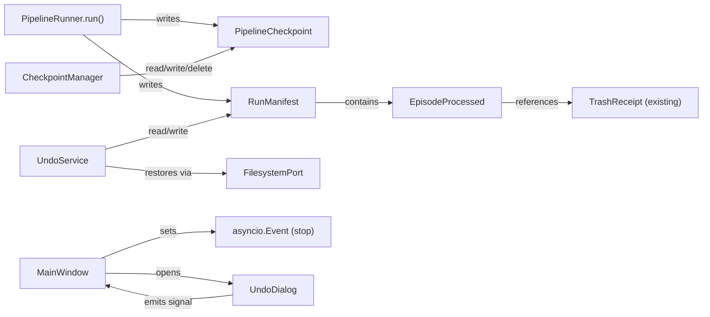
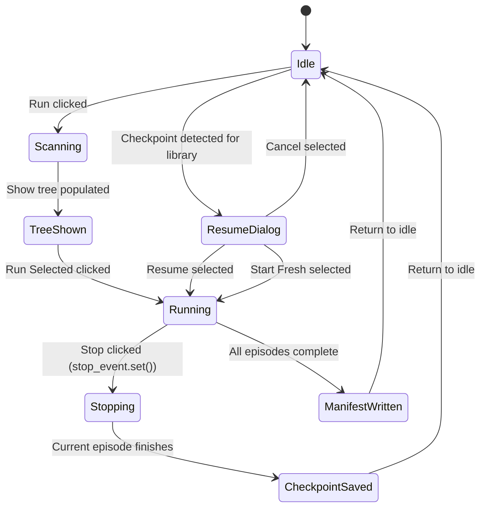

# Data Model: Pipeline Control & Safety (Phase 7.5)

**Date**: 2026-06-07

## New Models

### ProcessedStatus

**Location**: `src/models/run_manifest.py`
**Type**: `StrEnum`

| Value | Description |
|-------|-------------|
| `"success"` | Episode fully processed (muxed, trashed) |
| `"skipped"` | Episode skipped (no subtitle, embedded-only) |
| `"failed"` | Episode processing failed |

### EpisodeProcessed

**Location**: `src/models/run_manifest.py`
**Type**: Pydantic `BaseModel` (frozen)

| Field | Type | Constraints | Description |
|-------|------|-------------|-------------|
| `episode_path` | `SerializablePath` | Required | Original episode MKV path |
| `trash_receipt_path` | `SerializablePath \| None` | `default=None` | Path to trashed original file (None if skipped/failed) |
| `show_name` | `str` | `default=""` | Anime title for show-level grouping |
| `status` | `ProcessedStatus` | `default=SUCCESS` | Processing outcome |

### RunManifest

**Location**: `src/models/run_manifest.py`
**Type**: Pydantic `BaseModel` (frozen)

| Field | Type | Constraints | Description |
|-------|------|-------------|-------------|
| `run_id` | `str` | `min_length=1` | UUID string identifying the run |
| `timestamp` | `datetime` | Required | UTC timestamp of run start |
| `library_path` | `SerializablePath` | Required | Library root path |
| `episodes_processed` | `list[EpisodeProcessed]` | `default_factory=list` | All episodes in this run |

**Computed properties**:
- `success_count: int` — count of SUCCESS episodes
- `show_names: list[str]` — unique sorted show names

### PipelineCheckpoint

**Location**: `src/models/run_manifest.py`
**Type**: Pydantic `BaseModel` (frozen)

| Field | Type | Constraints | Description |
|-------|------|-------------|-------------|
| `library_path` | `SerializablePath` | Required | Library being processed |
| `completed_episodes` | `list[SerializablePath]` | `default_factory=list` | Episode paths already processed |
| `timestamp` | `datetime` | Required | Checkpoint creation time |
| `selected_paths` | `list[SerializablePath]` | `default_factory=list` | User's path selection at run start |

## Modified Models

### AppConfig

**Location**: `src/config.py`

**Added field**:

| Field | Type | Constraints | Description |
|-------|------|-------------|-------------|
| `max_run_history` | `int` | `ge=1, default=10` | Maximum run manifests to keep per library |

### PipelineRunner.run() signature change

**NOT a model change** — the `run()` method gains optional parameters:

| Parameter | Type | Default | Description |
|-----------|------|---------|-------------|
| `stop_event` | `asyncio.Event \| None` | `None` | Cooperative stop signal |
| `checkpoint_manager` | `CheckpointManager \| None` | `None` | For checkpoint persistence |
| `undo_service` | `UndoService \| None` | `None` | For manifest persistence |

> **CRITICAL**: `stop_event` is NOT added to `PipelineConfig` (frozen Pydantic model).

## Relationships



## Persistence Format

### Checkpoint TOML

```toml
library_path = "D:/Entertainment/Anime"
timestamp = "2026-06-07T10:30:00+00:00"

completed_episodes = [
  "D:/Entertainment/Anime/Show A/ep01.mkv",
  "D:/Entertainment/Anime/Show A/ep02.mkv",
]

selected_paths = [
  "D:/Entertainment/Anime/Show A",
]
```

### Run Manifest TOML

```toml
run_id = "550e8400-e29b-41d4-a716-446655440000"
timestamp = "2026-06-07T10:30:00+00:00"
library_path = "D:/Entertainment/Anime"

[[episodes_processed]]
episode_path = "D:/Entertainment/Anime/Show A/ep01.mkv"
trash_receipt_path = "D:/Entertainment/.anime_studio_trash/EXP-2026-07-07-ep01.mkv"
show_name = "Show A"
status = "success"

[[episodes_processed]]
episode_path = "D:/Entertainment/Anime/Show A/ep02.mkv"
trash_receipt_path = "D:/Entertainment/.anime_studio_trash/EXP-2026-07-07-ep02.mkv"
show_name = "Show A"
status = "success"
```

## Validation Rules

- `RunManifest.run_id` must be non-empty (UUID format)
- `PipelineCheckpoint.library_path` must be absolute
- All `SerializablePath` fields auto-resolve to absolute paths
- `ProcessedStatus` values must be one of: "success", "skipped", "failed"
- `max_run_history` must be >= 1

## State Transitions


