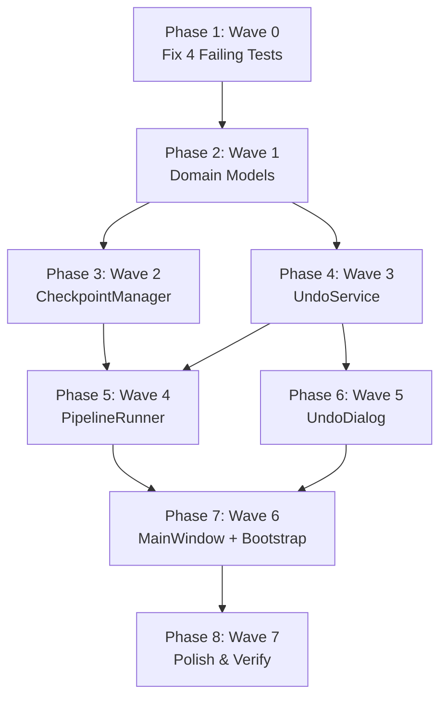

# Tasks: Pipeline Control & Safety (Phase 7.5)

**Input**: Design documents from `specs/010-pipeline-control-safety/`

**Prerequisites**: [plan.md](file:///d:/Dev/projects/Anime_studio/specs/010-pipeline-control-safety/plan.md) ✅, [spec.md](file:///d:/Dev/projects/Anime_studio/specs/010-pipeline-control-safety/spec.md) ✅, [data-model.md](file:///d:/Dev/projects/Anime_studio/specs/010-pipeline-control-safety/data-model.md) ✅

**Tests**: YES — write test first, verify fail, then implement. pytest-asyncio + `tmp_path` fixtures.

**Organization**: 8 waves (user-mandated order). Wave 0 = fix failing tests FIRST.

**Constitution**: v1.9.0 — Principle XV (Pipeline Control & Safety)

## Format: `[ID] [P?] [Story] Description`

- **[P]**: Can run in parallel (different files, no deps)
- **[Story]**: US1 = Smart Stop + Checkpoint, US2 = Undo System, US3 = Fix Failing Tests

## Design Decisions (Confirmed by User)

1. **Undo restore = MOVE** — `replace_file(trash_path, original_path)` via existing `FilesystemPort.replace_file()`. Trash copy deleted after restore. No new port method needed.
2. **Boundary test fix** — remove `"src.models"` from forbidden list in `test_boundary.py`. GUI files ARE allowed to import `src.models.*` directly (pure dataclasses, no I/O). Only `src.core`, `src.adapters`, `src.hunters` remain forbidden.
3. **main_window.py** `from src.core.log_export` — still forbidden → fix with `importlib.import_module()`.
4. **stop_event** — separate `run()` parameter, NOT in frozen `PipelineConfig`.

---

## Phase 1: Wave 0 — Fix 4 Failing Tests (MUST complete before ANY new code)

**Purpose**: Restore green test suite. 248 existing tests MUST all pass.

**⚠️ CRITICAL**: No new feature code until this wave completes with `uv run pytest - [x] T001 [US3] Fix boundary test in `tests/unit/gui/test_boundary.py` L60 — remove `"src.models"` from the forbidden tuple. Change `for forbidden in ("src.core", "src.adapters", "src.hunters", "src.models"):` to `for forbidden in ("src.core", "src.adapters", "src.hunters"):`. Rationale: GUI legitimately imports frozen dataclasses from `src.models.*` (e.g. `ShowNode`, `SubFolderNode` in `selection_tree.py`). Models are pure data with zero I/O — safe for direct import.
- [x] T002 [US3] Fix boundary violation in `src/gui/main_window.py` L344 — replace `from src.core.log_export import export_log_to_file` with `importlib.import_module("src.core.log_export")` dynamic import pattern. `importlib` already imported at L1. Change L344-345 to: `log_export_mod = importlib.import_module("src.core.log_export")` then `await log_export_mod.export_log_to_file(entries, Path(path))`.
- [x] T003 [US3] Fix `test_pipeline_runner_respects_selected_paths` assertion in `tests/unit/core/test_pipeline_runner.py` L320 — change `Path("/anime/Show A/episode_01.mkv").resolve()` to `Path("/anime/Show A/episode_01.mkv")`. Mock paths are NOT resolved; `.resolve()` on Windows prepends drive letter `D:\` causing mismatch.
- [x] T004 [US3] Verify `test_is_excluded_amux_temp_file` passes as-is in `tests/unit/core/test_library_scanner.py` L127-136. The `_is_excluded()` at `src/core/library_scanner.py` L96-106 is pure regex + relative path — no filesystem calls. Regex `^_amux_.*\.tmp\.\w+$` matches all test inputs. If passes: no change. If fails: debug regex.
- [x] T005 [US3] Verify `test_main_window_two_phase_run_flow` passes in `tests/unit/gui/test_main_window.py` L247-311. `ShowNode(name="Show A", path=tmp_path/"Show A", sub_folders=(), episodes=())` at L264-268 is valid for current dataclass at `src/models/pipeline.py` L79-90. `selection_tree.py` `populate()` accesses `.name`, `.path`, `.sub_folders`, `.total_count` — all exist on `ShowNode`. If fails after T001/T002: fix mock construction to match current model fields.
- [x] T006 [US3] Run full test suite: `uv run pytest tests/unit/ -v`. Verify 248+ tests pass, 0 failures. If any test still fails, fix before proceeding.

**Checkpoint**: All 248 existing tests green. Wave 0 complete.

**Constitution gate**: §I Hexagonal (boundary test updated), §IX Observability (no broken tests).

---

## Phase 2: Wave 1 — Domain Models

**Purpose**: Create `RunManifest`, `EpisodeProcessed`, `PipelineCheckpoint` models. Pure data, zero I/O.

### Tests for Wave 1

- [x] T007 [P] [US1] Write tests in `tests/unit/models/test_run_manifest.py`:
  - `test_pipeline_checkpoint_construction` — valid construction with all fields
  - `test_pipeline_checkpoint_frozen` — `model_copy` works, direct assignment raises
  - `test_pipeline_checkpoint_defaults` — empty lists for `completed_episodes`, `selected_paths`
  - `test_run_manifest_construction` — valid construction with `run_id`, `timestamp`, `library_path`, `episodes_processed`
  - `test_run_manifest_frozen` — immutability check
  - `test_run_manifest_success_count` — property counts only `ProcessedStatus.SUCCESS`
  - `test_run_manifest_show_names` — property returns sorted unique show names
  - `test_episode_processed_defaults` — `trash_receipt_path=None`, `show_name=""`, `status=SUCCESS`
  - All tests MUST FAIL initially (models don't exist yet).

### Implementation for Wave 1

- [x] T008 [P] [US1] Create `src/models/run_manifest.py` with:
  - `ProcessedStatus(StrEnum)`: `SUCCESS = "success"`, `SKIPPED = "skipped"`, `FAILED = "failed"`
  - `EpisodeProcessed(BaseModel, frozen)`: `episode_path: SerializablePath`, `trash_receipt_path: SerializablePath | None = None`, `show_name: str = ""`, `status: ProcessedStatus = ProcessedStatus.SUCCESS`
  - `RunManifest(BaseModel, frozen)`: `run_id: str = Field(min_length=1)`, `timestamp: datetime`, `library_path: SerializablePath`, `episodes_processed: list[EpisodeProcessed] = Field(default_factory=list)`. Properties: `success_count -> int`, `show_names -> list[str]`
  - `PipelineCheckpoint(BaseModel, frozen)`: `library_path: SerializablePath`, `completed_episodes: list[SerializablePath] = Field(default_factory=list)`, `timestamp: datetime`, `selected_paths: list[SerializablePath] = Field(default_factory=list)`
  - Import only from `src.models._types` (SerializablePath). No other project imports.

- [x] T009 [US1] Export new models from `src/models/__init__.py` — add `RunManifest`, `EpisodeProcessed`, `PipelineCheckpoint`, `ProcessedStatus` to imports and `__all__`.

- [x] T010 [US1] Run Wave 1 tests: `uv run pytest tests/unit/models/test_run_manifest.py -v`. All 8+ tests pass.

**Checkpoint**: Models exist and pass all tests. No I/O, no side effects.

**Constitution gate**: §I models/ imports NOTHING from project except `_types`. §XII YAGNI — only fields needed by spec.

---

## Phase 3: Wave 2 — CheckpointManager (US1: Smart Stop + Checkpoint)

**Purpose**: TOML read/write/delete for pipeline checkpoint files.

**Goal**: User can stop a pipeline and resume later. CheckpointManager handles checkpoint persistence.

**Independent Test**: Create checkpoint → read back → verify fields match. Delete → verify gone. Corrupt file → returns None.

### Tests for Wave 2

- [x] T011 [P] [US1] Write tests in `tests/unit/core/test_checkpoint_manager.py`:
  - `test_save_and_load_roundtrip(tmp_path)` — save checkpoint, load back, verify all fields match
  - `test_load_missing_file(tmp_path)` — no file → returns `None`
  - `test_load_corrupt_file(tmp_path)` — write garbage bytes to checkpoint path → returns `None`, no crash
  - `test_delete_checkpoint(tmp_path)` — save, delete, load → `None`
  - `test_delete_nonexistent(tmp_path)` — delete on missing file → no error
  - `test_creates_anime_studio_dir(tmp_path)` — `.anime_studio/` auto-created on first save
  - All async tests with `@pytest.mark.anyio`.

### Implementation for Wave 2

- [x] T012 [US1] Create `src/core/checkpoint_manager.py` with class `CheckpointManager`:
  - `_checkpoint_path(library_path: Path) -> Path` — returns `library_path / ".anime_studio" / "pipeline_checkpoint.toml"`
  - `async load(library_path: Path) -> PipelineCheckpoint | None` — read TOML via `asyncio.to_thread()`, parse into `PipelineCheckpoint`. On any error: log warning via structlog, return `None`.
  - `async save(checkpoint: PipelineCheckpoint) -> None` — write TOML via `asyncio.to_thread()`. Auto-create `.anime_studio/` dir. Manual TOML serialization (no `tomli_w`). TOML format: `library_path = "..."`, `timestamp = "..."`, `completed_episodes = [...]`, `selected_paths = [...]`. Paths as POSIX strings.
  - `async delete(library_path: Path) -> None` — unlink checkpoint file if exists via `asyncio.to_thread()`.
  - Imports: `tomllib` (read), `structlog`, `asyncio`, `datetime`, `pathlib.Path`, `src.models.run_manifest.PipelineCheckpoint`.

- [x] T013 [US1] Run Wave 2 tests: `uv run pytest tests/unit/core/test_checkpoint_manager.py -v`. All 6+ tests pass.

**Checkpoint**: CheckpointManager works. Roundtrip verified.

**Constitution gate**: §I core/ imports only models/ and ports/. §III async-first (to_thread for I/O). §XV TOML persistence.

---

## Phase 4: Wave 3 — UndoService (US2: Undo System)

**Purpose**: Manage run manifests + restore original files from trash using MOVE semantics via existing `FilesystemPort.replace_file()`.

**Goal**: User can undo pipeline runs at episode/show/full-run granularity.

**Independent Test**: Save manifest → list manifests → undo full run → verify files restored + trash files gone.

### Tests for Wave 3

- [x] T014 [P] [US2] Write tests in `tests/unit/core/test_undo_service.py`:
  - `test_save_and_list_manifests(tmp_path)` — save 2 manifests, list returns both newest-first
  - `test_prune_old_manifests(tmp_path)` — save 12 manifests with max_history=10, verify only 10 remain (oldest 2 pruned)
  - `test_undo_full_run(tmp_path)` — create manifest with 3 episodes, put mock files at trash paths, undo all → verify original paths have files, trash paths gone
  - `test_undo_by_show(tmp_path)` — manifest with 2 shows, undo 1 show, verify only that show's files restored
  - `test_undo_specific_episodes(tmp_path)` — undo 1 of 3 episodes, verify only 1 restored
  - `test_undo_missing_trash_file(tmp_path)` — trash file doesn't exist → returns (0, 1), no crash
  - `test_undo_destination_exists(tmp_path)` — file already at destination → skip with warning, returns (0, 1)
  - `test_undo_skipped_episodes_ignored(tmp_path)` — episodes with SKIPPED/FAILED status not restored
  - `test_list_empty_history(tmp_path)` — no manifests dir → empty list
  - `test_corrupt_manifest_skipped(tmp_path)` — corrupt TOML in run_history → skipped in listing, no crash
  - `test_create_manifest_id()` — returns valid UUID4 string
  - All async with `@pytest.mark.anyio`. Use real `tmp_path` filesystem + mock `FilesystemPort`.

### Implementation for Wave 3

- [x] T015 [US2] Create `src/core/undo_service.py` with class `UndoService`:
  - Constructor: `__init__(self, filesystem: FilesystemPort, max_history: int = 10)`.
  - `_history_dir(library_path: Path) -> Path` — returns `library_path / ".anime_studio" / "run_history"`.
  - `async save_manifest(manifest: RunManifest) -> Path` — write TOML using `[[episodes_processed]]` array-of-tables syntax, auto-prune after write. Return manifest path.
  - `async list_manifests(library_path: Path) -> list[RunManifest]` — glob `run_*.toml`, parse each via `tomllib`, newest-first sort, skip corrupt with structlog warning.
  - `async undo_episodes(manifest: RunManifest, episode_paths: set[Path] | None = None) -> tuple[int, int]` — for each SUCCESS episode: (1) verify `trash_receipt_path` exists (skip with warning if None), (2) verify trash file exists on disk (skip with "auto-purged" warning if not), (3) verify destination doesn't already exist (skip with warning if it does), (4) call `self._fs.replace_file(trash_path, original_path)` to MOVE. Returns `(restored_count, failed_count)`.
  - `async undo_by_show(manifest: RunManifest, show_name: str) -> tuple[int, int]` — filter episodes by `show_name`, delegate to `undo_episodes`.
  - `async _prune_old(library_path: Path) -> None` — delete oldest manifests beyond `max_history`.
  - `_write_manifest(path, manifest)` static — manual TOML write with `[[episodes_processed]]` tables.
  - `_read_manifest(path)` static — `tomllib.load()` → `RunManifest`.
  - `create_manifest_id()` static — `str(uuid.uuid4())`.
  - Imports: `tomllib`, `structlog`, `asyncio`, `uuid`, `datetime`, `pathlib.Path`, `src.models.run_manifest.*`, `src.ports.filesystem.FilesystemPort`.

- [x] T016 [US2] Run Wave 3 tests: `uv run pytest tests/unit/core/test_undo_service.py -v`. All 11+ tests pass.

**Checkpoint**: UndoService works. MOVE restore verified. Prune verified.

**Constitution gate**: §I core/ imports models/ + ports/ only. §VI Data Safety (MOVE via replace_file). §XV TOML persistence.

---

## Phase 5: Wave 4 — PipelineRunner Integration (US1 + US2)

**Purpose**: Wire `stop_event`, checkpoint save, and manifest write into `PipelineRunner.run()`.

**Goal**: Pipeline can be stopped gracefully, checkpoints saved, manifests written on completion.

**Independent Test**: Run pipeline with `stop_event` set after 1 episode → verify checkpoint. Run without stop → verify manifest.

### Tests for Wave 4

- [x] T017 [P] [US1] Write new tests in `tests/unit/core/test_pipeline_runner.py`:
  - `test_pipeline_runner_stop_event_stops_processing` — create `asyncio.Event()`, set it after first episode analyzed (patch `_analyze_episode` side_effect to set event). Verify only 1 episode in report, not all.
  - `test_pipeline_runner_stop_event_writes_checkpoint` — mock `checkpoint_manager`, stop mid-run, verify `checkpoint_manager.save()` called with `PipelineCheckpoint` containing correct `completed_episodes` list.
  - `test_pipeline_runner_writes_manifest_on_completion` — mock `undo_service`, run to completion, verify `undo_service.save_manifest()` called with `RunManifest` containing correct episodes.
  - `test_pipeline_runner_deletes_checkpoint_on_completion` — mock `checkpoint_manager`, run to completion, verify `checkpoint_manager.delete()` called.
  - `test_pipeline_runner_no_checkpoint_when_no_manager` — run without `checkpoint_manager` param → no error, no crash.

- [x] T018 [US1] Add `max_run_history: int = Field(default=10, ge=1)` to `AppConfig` in `src/config.py` between L20-21 (after `trash_max_age_days`). Also add to `save_to_toml()` serialization at L44-59.

### Implementation for Wave 4

- [x] T019 [US1] Modify `PipelineRunner.run()` signature in `src/core/pipeline_runner.py` L57 — add 3 optional params after `pipeline_config`:
  ```python
  async def run(
      self,
      pipeline_config: PipelineConfig,
      stop_event: asyncio.Event | None = None,
      checkpoint_manager: Any | None = None,
      undo_service: Any | None = None,
  ) -> PipelineReport:
  ```
  Use `Any` type hints (already imported) to avoid circular imports. These are duck-typed services.

- [x] T020 [US1] Add stop_event check in analysis loop at `src/core/pipeline_runner.py` L168-173 — at top of `for scan in external_scans:` loop body, before `ctx = await self._analyze_episode(...)`, insert:
  ```python
  if stop_event and stop_event.is_set():
      logger.info("stop signal received, saving checkpoint", stage="stop")
      if checkpoint_manager:
          from src.models.run_manifest import PipelineCheckpoint
          checkpoint = PipelineCheckpoint(
              library_path=pipeline_config.library_path,
              completed_episodes=[c.scan_result.episode_path for c in episode_contexts],
              timestamp=datetime.now(timezone.utc),
              selected_paths=list(pipeline_config.selected_paths or []),
          )
          await checkpoint_manager.save(checkpoint)
      break
  ```

- [x] T021 [US1] Add stop_event check before mux dispatch at `src/core/pipeline_runner.py` L326-328 — wrap existing mux gather in:
  ```python
  if stop_event and stop_event.is_set():
      final_contexts = list(episode_contexts)  # no muxing
  else:
      mux_tasks = [_mux_and_post_process(ctx) for ctx in episode_contexts]
      final_contexts = await asyncio.gather(*mux_tasks)
  ```

- [x] T022 [US2] Add manifest write after report building at `src/core/pipeline_runner.py` — before `return report` (L419), insert:
  ```python
  if undo_service and not (stop_event and stop_event.is_set()):
      from src.models.run_manifest import RunManifest, EpisodeProcessed, ProcessedStatus
      manifest_episodes = []
      for ctx in final_contexts:
          ep_status = (ProcessedStatus.SUCCESS if ctx.status == EpisodeStatus.COMPLETE
                       else ProcessedStatus.SKIPPED if ctx.status == EpisodeStatus.SKIPPED
                       else ProcessedStatus.FAILED)
          trash_path = ctx.trash_receipts[0].trash_path if ctx.trash_receipts else None
          manifest_episodes.append(EpisodeProcessed(
              episode_path=ctx.scan_result.episode_path,
              trash_receipt_path=trash_path,
              show_name=ctx.scan_result.anime_title,
              status=ep_status,
          ))
      manifest = RunManifest(
          run_id=undo_service.create_manifest_id(),
          timestamp=run_timestamp,
          library_path=pipeline_config.library_path,
          episodes_processed=manifest_episodes,
      )
      await undo_service.save_manifest(manifest)
  ```

- [x] T023 [US1] Add checkpoint deletion on successful completion — after manifest write, before `return report`:
  ```python
  if checkpoint_manager and not (stop_event and stop_event.is_set()):
      await checkpoint_manager.delete(pipeline_config.library_path)
  ```

- [x] T024 [US1] Run Wave 4 tests: `uv run pytest tests/unit/core/test_pipeline_runner.py -v`. All existing + 5 new tests pass.

**Checkpoint**: PipelineRunner supports stop_event + checkpoint + manifest.

**Constitution gate**: §I no GUI imports in core/. §XV asyncio.Event (never hard-kill). §Constraint stop_event NOT in PipelineConfig.

---

## Phase 6: Wave 5 — UndoDialog (US2: Undo System GUI)

**Purpose**: QDialog widget for undo operations. Pure presentation — no core imports.

### Tests for Wave 5

- [x] T025 [P] [US2] Write tests in `tests/unit/gui/test_undo_dialog.py`:
  - `test_undo_dialog_creation` — constructs without error
  - `test_undo_dialog_populate_manifests` — populate with 2 mock manifests (duck-typed objects with `.timestamp`, `.success_count`, `.show_names`, `.library_path`, `.episodes_processed`), verify combo box has 2 items
  - `test_undo_dialog_level_radio_buttons` — default is "full run", selecting show/episode radios shows item list
  - `test_undo_dialog_signal_emission` — click OK emits `undo_requested` signal with correct dict payload `{"manifest_index": 0, "level": "full"}`
  - `test_undo_dialog_empty_manifests` — populate with `[]` → combo empty

### Implementation for Wave 5

- [x] T026 [US2] Create `src/gui/widgets/undo_dialog.py` with class `UndoDialog(QDialog)`:
  - Signal: `undo_requested = Signal(dict)` — emits `{"manifest_index": int, "level": "full"|"show"|"episode", ...}`
  - Constructor: `QComboBox` for run selection, `QGroupBox` with 3 `QRadioButton` (full/show/episode), `QListWidget` for show/episode detail selection, `QDialogButtonBox` (OK/Cancel).
  - `populate(manifests: list)` — fill combo with `f"{m.timestamp:%Y-%m-%d %H:%M} — {m.success_count} episodes"`. Duck typing — no model imports needed.
  - `_on_run_selected(index)` — update info label with library path + show names.
  - `_on_level_changed()` — show/hide QListWidget based on radio selection. Populate with show names or episode names from selected manifest.
  - `_on_accept()` — build result dict based on selected radio + list items, emit `undo_requested` signal, call `self.accept()`.
  - **NO** imports from `src.core`, `src.adapters`, `src.hunters`. PySide6-only widget. May import `src.models` (allowed per T001).

- [x] T027 [US2] Export `UndoDialog` from `src/gui/widgets/__init__.py` — add import and `__all__` entry.

- [x] T028 [US2] Run Wave 5 tests: `uv run pytest tests/unit/gui/test_undo_dialog.py -v`. All 5 tests pass.

**Checkpoint**: UndoDialog works. No core boundary violations.

**Constitution gate**: §I no core/adapters/hunters imports. GUI signals for communication.

---

## Phase 7: Wave 6 — MainWindow Integration + Bootstrap

**Purpose**: Wire Stop button, Undo button, resume dialog into MainWindow. Wire services in bootstrap.

### Tests for Wave 6

- [x] T029 [P] [US1] Write tests in `tests/unit/gui/test_main_window.py`:
  - `test_main_window_stop_button_hidden_initially` — stop button exists but `isVisible() is False`
  - `test_main_window_stop_button_visible_during_run` — set `_pipeline_running = True`, verify stop button visible
  - `test_main_window_undo_button_disabled_during_run` — undo button disabled when `_pipeline_running = True`
  - `test_main_window_constructor_accepts_checkpoint_and_undo` — new optional params don't break construction

### Implementation for Wave 6

- [x] T030 [US1] Modify `MainWindow.__init__()` in `src/gui/main_window.py` — add params `checkpoint_manager: Any = None` and `undo_service: Any = None`. Store as `self._checkpoint_manager` and `self._undo_service`. Add `self._stop_event: asyncio.Event | None = None`. Import `asyncio` at top.

- [x] T031 [US1] Add Stop button in `src/gui/main_window.py` `__init__()` after run_button (L88-89):
  - `self.stop_button = QPushButton("Stop", config_group)`
  - `self.stop_button.setVisible(False)`
  - `config_layout.addWidget(self.stop_button)`
  - `self.stop_button.clicked.connect(self._on_stop_click)`
  - Add method `_on_stop_click(self)`: `if self._stop_event: self._stop_event.set()`, `self.stop_button.setEnabled(False)`, `self.stop_button.setText("Stopping...")`.

- [x] T032 [US1] Modify `_on_run_click()` Phase 1 in `src/gui/main_window.py` L244-268 — before scan (L259), check checkpoint if `self._checkpoint_manager`:
  ```python
  if self._checkpoint_manager:
      checkpoint = await self._checkpoint_manager.load(p)
      if checkpoint:
          reply = QMessageBox.question(
              self, "Resume Previous Run?",
              f"Found checkpoint with {len(checkpoint.completed_episodes)} completed episodes.\n\n"
              "Yes = Resume (skip completed)\nNo = Start Fresh\nCancel = Do nothing",
              QMessageBox.StandardButton.Yes | QMessageBox.StandardButton.No | QMessageBox.StandardButton.Cancel,
          )
          if reply == QMessageBox.StandardButton.Cancel:
              self._pipeline_running = False
              self.library_picker.setEnabled(True)
              self.run_button.setEnabled(True)
              return
          if reply == QMessageBox.StandardButton.No:
              await self._checkpoint_manager.delete(p)
  ```

- [x] T033 [US1] Modify `_on_run_click()` Phase 2 in `src/gui/main_window.py` L183-242 — before `report = await self.pipeline_runner.run(config)`:
  - Create `self._stop_event = asyncio.Event()`
  - `self.stop_button.setVisible(True)`
  - Pass `stop_event=self._stop_event`, `checkpoint_manager=self._checkpoint_manager`, `undo_service=self._undo_service` to `pipeline_runner.run()`.
  - In `finally` block: `self.stop_button.setVisible(False)`, `self.stop_button.setText("Stop")`, `self.stop_button.setEnabled(True)`, `self._stop_event = None`.

- [x] T034 [US2] Add Undo button in `src/gui/main_window.py` `__init__()` after import_button (L85-86):
  - `self.undo_button = QPushButton("Undo", config_group)`
  - `config_layout.addWidget(self.undo_button)`
  - `self.undo_button.clicked.connect(self._on_undo_click)`

- [x] T035 [US2] Implement `_on_undo_click()` as `@asyncSlot()` handler in `src/gui/main_window.py`:
  ```python
  @asyncSlot()
  async def _on_undo_click(self) -> None:
      if not self._undo_service:
          return
      library_path = self.library_picker.get_path()
      if not library_path:
          QMessageBox.warning(self, "No Library", "Select a library first.")
          return
      p = Path(library_path)
      manifests = await self._undo_service.list_manifests(p)
      if not manifests:
          QMessageBox.information(self, "No History", "No pipeline runs to undo.")
          return
      from src.gui.widgets.undo_dialog import UndoDialog
      dialog = UndoDialog(self)
      dialog.populate(manifests)
      dialog.undo_requested.connect(lambda r: asyncio.ensure_future(self._execute_undo(manifests, r)))
      dialog.exec()
  ```

- [x] T036 [US2] Implement `_execute_undo()` async method in `src/gui/main_window.py`:
  ```python
  async def _execute_undo(self, manifests: list, result: dict) -> None:
      idx = result["manifest_index"]
      manifest = manifests[idx]
      level = result["level"]
      if level == "full":
          restored, failed = await self._undo_service.undo_episodes(manifest)
      elif level == "show":
          restored, failed = 0, 0
          for name in result.get("show_names", []):
              r, f = await self._undo_service.undo_by_show(manifest, name)
              restored += r; failed += f
      else:  # episode
          ep_names = set(result.get("episode_names", []))
          ep_paths = {ep.episode_path for ep in manifest.episodes_processed if ep.episode_path.name in ep_names}
          restored, failed = await self._undo_service.undo_episodes(manifest, ep_paths)
      QMessageBox.information(self, "Undo Complete", f"Restored: {restored}, Failed: {failed}")
  ```

- [x] T037 Disable undo button during pipeline run. In `_on_run_click()` Phase 2 setup: `self.undo_button.setEnabled(False)`. In `finally` block: `self.undo_button.setEnabled(True)`.

- [x] T038 Wire `CheckpointManager` and `UndoService` in `src/gui/bootstrap.py` after L208 (pipeline_runner creation):
  ```python
  core_checkpoint = importlib.import_module("src.core.checkpoint_manager")
  CheckpointManager = core_checkpoint.CheckpointManager
  checkpoint_manager = CheckpointManager()

  core_undo = importlib.import_module("src.core.undo_service")
  UndoService = core_undo.UndoService
  undo_service = UndoService(filesystem=filesystem_adapter, max_history=config.max_run_history)
  ```
  Update `MainWindow` constructor call at L232-237 — add `checkpoint_manager=checkpoint_manager`, `undo_service=undo_service`.

- [x] T039 Run Wave 6 tests: `uv run pytest tests/unit/gui/test_main_window.py -v`. All existing + 4 new tests pass.

**Checkpoint**: Full UI integration. Stop + Resume + Undo all wired.

**Constitution gate**: §I bootstrap uses `importlib.import_module()` for core imports. §XV asyncio.Event for stop.

---

## Phase 8: Wave 7 — Polish & Verification

**Purpose**: Lint, format, boundary check, full test suite.

- [x] T040 Run `uv run ruff check src/ tests/ --fix` — fix any lint issues. Target: 0 warnings.
- [x] T041 Run `uv run ruff format src/ tests/` — format all files.
- [x] T042 Run `uv run pytest tests/unit/gui/test_boundary.py -v` — verify AST boundary test passes with updated forbidden list (no `src.models`).
- [x] T043 Run full test suite: `uv run pytest tests/unit/ -v`. Verify 248 existing + ~30 new ≈ 278+ total, 0 failures.
- [x] T044 Update `COMPACT_STATE.md` — set constitution to v1.9.0, add Phase 7.5 to timeline as ✅ DONE, update test count to new total.

**Checkpoint**: All green. Phase 7.5 complete.

**Constitution gate**: §IX Quality gates — `ruff check` 0 warnings, `ruff format` 0 diffs, all tests pass.

---

## Dependencies & Execution Order

### Phase Dependencies



### User Story Dependencies

- **US3 (Fix Tests)**: Phase 1 — FIRST, blocks everything
- **US1 (Stop + Checkpoint)**: Phases 2-3, 5, 7 — models → checkpoint_manager → pipeline_runner → main_window
- **US2 (Undo)**: Phases 2, 4, 6, 7 — models → undo_service → undo_dialog → main_window
- **US1 and US2 share**: Wave 1 (models) and Wave 6 (MainWindow)

### Within Each Wave

- Tests FIRST → verify FAIL → implement → verify PASS
- Models before services
- Services before GUI
- Core implementation before integration

### Parallel Opportunities

- T007, T008 can run in parallel (test file vs model file — different files)
- T011, T014 can run in parallel (different test files)
- T017, T025 can run in parallel (different test files)
- T029 can overlap with T026 (different files)
- Wave 2 and Wave 3 can overlap (CheckpointManager vs UndoService — independent services)
- Wave 4 and Wave 5 can overlap (PipelineRunner vs UndoDialog — no dependency)

---

## Parallel Example: Wave 2 + Wave 3

```bash
# These two waves have no inter-dependencies:
Wave 2: CheckpointManager (T011 → T012 → T013)
Wave 3: UndoService       (T014 → T015 → T016)
# Can execute simultaneously by different agents
```

---

## Implementation Strategy

### MVP First (US3 + US1 Only)

1. Complete Wave 0: Fix Tests (T001-T006)
2. Complete Wave 1: Models (T007-T010)
3. Complete Wave 2: CheckpointManager (T011-T013)
4. Complete Wave 4: PipelineRunner integration (T017-T024)
5. **STOP and VALIDATE**: `uv run pytest tests/unit/ -v`. Stop + checkpoint working.

### Full Delivery

6. Complete Wave 3: UndoService (T014-T016)
7. Complete Wave 5: UndoDialog (T025-T028)
8. Complete Wave 6: MainWindow + Bootstrap (T029-T039)
9. Complete Wave 7: Polish (T040-T044)

### Regression Check

Run `uv run pytest tests/unit/ -v` after every 5 tasks to catch regressions early.

---

## Notes

- [P] tasks = different files, no dependencies
- [Story] label maps: US1=Stop+Checkpoint, US2=Undo, US3=Fix Tests
- `stop_event` is NEVER added to `PipelineConfig` — separate `run()` parameter
- Undo uses MOVE semantics via existing `FilesystemPort.replace_file()` — no new port methods
- All TOML writes use manual serialization (no `tomli_w` dependency)
- GUI CAN import `src.models.*` directly — boundary test updated to allow it
- GUI CANNOT import `src.core.*`, `src.adapters.*`, `src.hunters.*` — must use `importlib`
