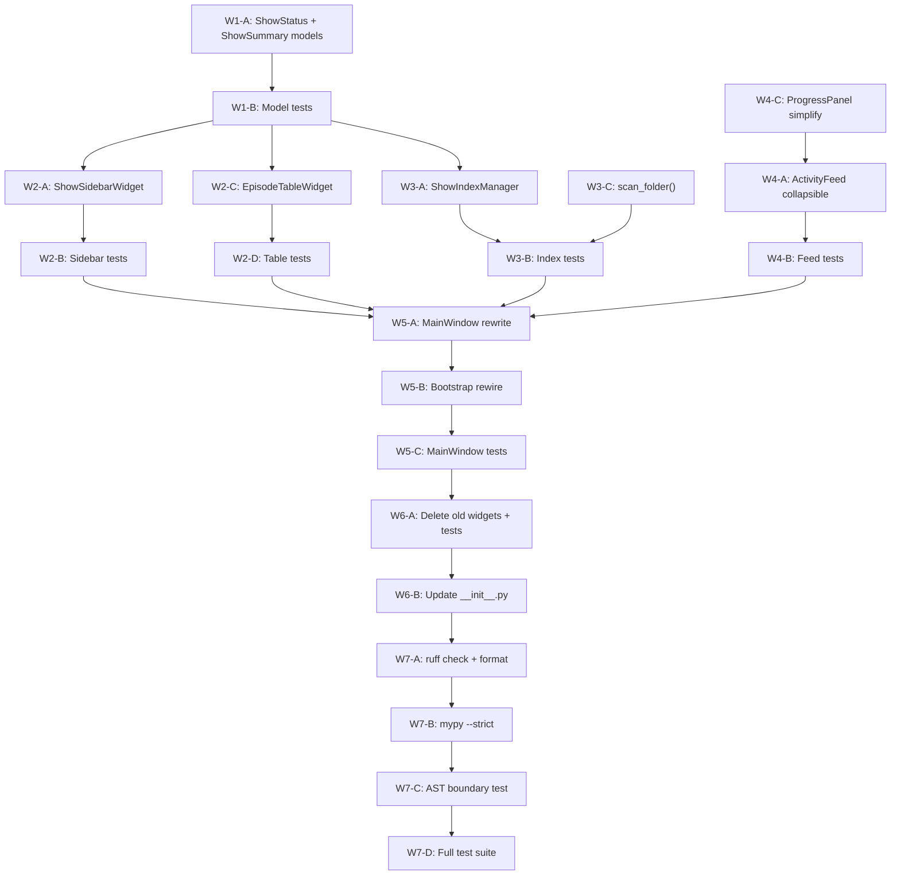

# Implementation Plan: GUI Redesign — Two-Panel Layout (Phase 8a)

**Branch**: `011-gui-redesign` | **Date**: 2026-06-27 | **Spec**: [spec.md](file:///d:/Dev/projects/Anime_studio/specs/011-gui-redesign/spec.md)

**Input**: Feature specification from `specs/011-gui-redesign/spec.md`

## Summary

Replace vertical-stack GUI with modern two-panel layout (sidebar + main panel).
Three critical UX problems fixed:
1. **Inverted workflow**: app auto-scans entire library (~11 min) before user selects anything → select first, scan on demand
2. **Outdated layout**: vertical stack cramming all widgets → horizontal split with clear hierarchy
3. **Checkbox tree**: `QTreeView` with checkboxes → show list (sidebar) + episode table (main panel)

## Technical Context

**Language/Version**: Python 3.11+

**Primary Dependencies**: PySide6 (>=6.6,<6.8), qasync, structlog, Pydantic v2, tomllib (built-in)

**Storage**: TOML files — `.anime_studio/show_index.toml` (new cached show index)

**Testing**: pytest + pytest-asyncio (271 existing tests)

**Target Platform**: Windows-first (cross-platform via PySide6)

**Project Type**: Desktop app (PySide6 GUI + async pipeline)

**Performance Goals**: Startup with cached index <1s; single-folder scan <10s; 500+ episode table renders without lag

**Constraints**: No new dependencies; no business logic in GUI; `pathlib.Path` everywhere; `asyncio.to_thread()` for blocking I/O; all 271 existing tests must pass after changes

**Scale/Scope**: Typical library: 10–100 shows, 12–26 episodes per show. Max ~600 total episodes.

## Constitution Check

*GATE: Must pass before Phase 0 research. Re-check after Phase 1 design.*

| Gate | Principle | Status | Notes |
|------|-----------|--------|-------|
| No business logic in GUI | §I Hexagonal | ✅ PASS | Episode filtering in `library_scanner.py`; show index in `show_index.py` (core); widgets only render + emit signals |
| No `asyncio.Queue` for Qt UI | §Forbidden | ✅ PASS | All via `SignalBridge` + `@asyncSlot`. No new queues |
| `pathlib.Path` everywhere | §II Cross-Platform | ✅ PASS | All paths as `Path` objects in new models and services |
| `asyncio.to_thread()` for file I/O | §III Async-First | ✅ PASS | Index TOML read/write via `asyncio.to_thread()` |
| No new deps | §XII YAGNI | ✅ PASS | All PySide6 built-in widgets. No new packages |
| Models in `models/` | §I Separation | ✅ PASS | `ShowStatus`, `ShowSummary` in `src/models/pipeline.py` |
| Structured logging | §IX Observability | ✅ PASS | All new code uses `structlog.get_logger()` |
| GUI = pure consumer | §I Separation | ✅ PASS | No subprocess/filesystem calls in widgets |
| `encoding="utf-8"` on all `open()` | §VIII Encoding | ✅ PASS | `ShowIndexManager` TOML write uses explicit encoding |
| Dynamic imports in bootstrap | §I Hexagonal | ✅ PASS | Core modules via `importlib.import_module()` in bootstrap |
| AST boundary compliance | §I Hexagonal | ✅ PASS | New widgets import only `src.models` + `src.gui.signals` |
| `ruff check` + `ruff format` clean | §Code Quality | ✅ PASS | Verified in Wave 7 |

**Gate Result**: ALL PASS — no violations.

## Project Structure

### Documentation (this feature)

```text
specs/011-gui-redesign/
├── spec.md              # Feature specification
├── plan.md              # This file
├── research.md          # Phase 0 output
├── data-model.md        # Phase 1 output
├── quickstart.md        # Phase 1 output
└── checklists/
    └── requirements.md  # Spec quality checklist
```

### Source Code (files touched)

```text
src/
├── models/
│   └── pipeline.py              # [MODIFY] Add ShowStatus, ShowSummary
├── core/
│   ├── library_scanner.py       # [MODIFY] Add scan_folder() method
│   └── show_index.py            # [NEW] ShowIndexManager (cached TOML index)
├── gui/
│   ├── main_window.py           # [MODIFY] Two-panel layout rewrite
│   ├── bootstrap.py             # [MODIFY] Rewire startup, remove auto-scan
│   ├── signals.py               # [MODIFY] Add episodes_ready, show_status_changed signals
│   └── widgets/
│       ├── __init__.py          # [MODIFY] Swap exports
│       ├── show_sidebar.py      # [NEW] ShowSidebarWidget + custom delegate
│       ├── episode_table.py     # [NEW] EpisodeTableWidget + model + delegate
│       ├── activity_feed.py     # [MODIFY] Make collapsible
│       ├── progress_panel.py    # [MODIFY] Simplify styling
│       ├── selection_tree.py    # [DELETE] Replaced by ShowSidebarWidget
│       └── library_picker.py    # [DELETE] Replaced by sidebar + header bar

tests/unit/
├── gui/
│   ├── test_show_sidebar.py     # [NEW] 6 tests
│   ├── test_episode_table.py    # [NEW] 8 tests
│   ├── test_activity_feed.py    # [MODIFY] +2 collapsible tests
│   ├── test_main_window.py      # [MODIFY] Rewrite for new widgets
│   ├── test_boundary.py         # [MODIFY] Add new widget files to scan
│   ├── test_selection_tree.py   # [DELETE] Widget removed
│   └── test_library_picker.py   # [DELETE] Widget removed
└── core/
    └── test_show_index.py       # [NEW] 3 tests
```

**Structure Decision**: Follows existing Hexagonal Architecture. New service in
`src/core/`, new models in `src/models/`, new widgets in `src/gui/widgets/`.
No new directories outside conventions.

---

## Dependency Graph & Execution Order



### Execution Waves

| Wave | Tasks | Parallel? | Description |
|------|-------|-----------|-------------|
| **1** | W1-A, W1-B | Sequential | Domain models (ShowStatus, ShowSummary) + tests |
| **2** | W2-A, W2-B, W2-C, W2-D | Sidebar ∥ Table | New widgets + tests |
| **3** | W3-A, W3-B, W3-C | Sequential | Core services (ShowIndexManager + scan_folder) + tests |
| **4** | W4-A, W4-B, W4-C | Sequential | Modify existing widgets (collapsible feed, simplified progress) |
| **5** | W5-A, W5-B, W5-C | Sequential | MainWindow rewrite + bootstrap rewire + tests |
| **6** | W6-A, W6-B | Sequential | Delete old widgets (`selection_tree.py`, `library_picker.py`) + tests |
| **7** | W7-A, W7-B, W7-C, W7-D | Sequential | Verification: ruff, mypy, boundary, full suite |

---

## Detailed Component Plans

### Wave 1: Domain Models

#### W1-A: [MODIFY] [pipeline.py](file:///d:/Dev/projects/Anime_studio/src/models/pipeline.py)

Add `ShowStatus` enum (StrEnum, 6 values) and `ShowSummary` frozen dataclass:

```python
class ShowStatus(StrEnum):
    PENDING = "pending"           # gray — not yet scanned
    PROCESSING = "processing"     # spinner — scan in progress
    READY = "ready"               # amber — scanned, episodes available
    ALL_DONE = "all_done"         # green — all episodes muxed
    NO_SUBTITLE = "no_subtitle"   # yellow warning — MKVs but no ASS
    WARNING = "warning"           # red — errors occurred

@dataclass(frozen=True)
class ShowSummary:
    name: str
    path: Path
    status: ShowStatus
    episode_count: int
    processed_count: int
    subtitle_text: str  # "12 ready / 2 processed"
```

**~25 lines added.** Import `StrEnum` from `enum`.

#### W1-B: Model unit tests

Test `ShowStatus` values, `ShowSummary` construction, frozen enforcement.
Add to existing `tests/unit/models/` test patterns. ~15 lines.

---

### Wave 2: New Widgets

#### W2-A: [NEW] [show_sidebar.py](file:///d:/Dev/projects/Anime_studio/src/gui/widgets/show_sidebar.py)

`ShowSidebarWidget` — left panel show list.

**Signals**:
- `show_selected = Signal(str, object)` — `(show_name, folder_path: Path)`
- `add_folder_requested = Signal()`
- `refresh_requested = Signal()`

**Key Methods**:
- `populate(shows: list[ShowSummary]) -> None` — fill list from cache
- `update_show_status(show_name: str, status: ShowStatus) -> None` — update icon
- `add_show(show: ShowSummary) -> None` — append without clearing
- `clear() -> None`

**Implementation**:
- `QListWidget` with custom `QStyledItemDelegate` for rich rendering
- Each item: status icon (16×16 colored circle via `QPainter`) + show name (bold) + subtitle line (gray, smaller)
- Fixed width: `setFixedWidth(220)`
- Bottom bar: `QPushButton("+ Add Folder")` + `QPushButton("↻")` (refresh)
- `QListWidget.currentItemChanged` → emits `show_selected`

**~180 lines.**

#### W2-B: Sidebar tests — `tests/unit/gui/test_show_sidebar.py`

| Test | Verifies |
|------|----------|
| `test_instantiation` | Widget creates without error |
| `test_populate_shows` | `populate()` fills list with correct items |
| `test_show_selected_signal` | Clicking item emits `show_selected(name, path)` |
| `test_status_icon_rendering` | Correct icon color per `ShowStatus` |
| `test_add_show` | `add_show()` appends without clearing |
| `test_update_show_status` | `update_show_status()` changes icon |

**~120 lines.**

#### W2-C: [NEW] [episode_table.py](file:///d:/Dev/projects/Anime_studio/src/gui/widgets/episode_table.py)

`EpisodeTableWidget` — main panel episode list with selection.

**Internal Model**: `EpisodeTableModel(QAbstractTableModel)`

**Columns**:

| # | Header | Data | Width |
|---|--------|------|-------|
| 0 | ☑ | Checkbox (select for run) | 30px |
| 1 | Episode | Filename + font info | stretch |
| 2 | Subtitle | Matched .ass name or "Embedded" | 180px |
| 3 | Status | Badge: Muxed/Pending/Skipped/Error | 100px |

**Signals**:
- `selection_changed = Signal(list)` — `list[Path]` of selected episodes

**Key Methods**:
- `populate(episodes: list[LibraryScanResult]) -> None`
- `update_episode_status(episode_path: Path, status: str) -> None`
- `get_selected_episodes() -> list[Path]`
- `select_all() -> None` / `deselect_all() -> None`
- `clear() -> None`

**Implementation**:
- `QTableView` + custom `QAbstractTableModel`
- Header checkbox: "Select all" via `QHeaderView.sectionClicked`
- Status badge rendering via `QStyledItemDelegate.paint()`:
  - Muxed → green rounded rect with white text
  - Pending → amber rounded rect
  - Skipped → gray rounded rect
  - Error → red rounded rect
- `dataChanged` on checkbox toggle → emits `selection_changed`
- Sorting by column header click

**~280 lines** (model + delegate + widget).

#### W2-D: Table tests — `tests/unit/gui/test_episode_table.py`

| Test | Verifies |
|------|----------|
| `test_instantiation` | Widget + model create without error |
| `test_populate_episodes` | `populate()` fills table from `LibraryScanResult` list |
| `test_selection_changed_signal` | Checkbox toggle emits `selection_changed` |
| `test_select_all` | Header checkbox selects all rows |
| `test_status_badge_muxed` | Green badge for muxed |
| `test_status_badge_pending` | Amber badge for pending |
| `test_status_badge_error` | Red badge for error |
| `test_get_selected_episodes` | Returns correct `list[Path]` |

**~180 lines.**

---

### Wave 3: Core Services

#### W3-A: [NEW] [show_index.py](file:///d:/Dev/projects/Anime_studio/src/core/show_index.py)

`ShowIndexManager` — manages cached show index TOML for instant sidebar population.

```python
class ShowIndexManager:
    INDEX_FILE = "show_index.toml"

    async def load(self, data_dir: Path) -> list[ShowSummary]: ...
    async def save(self, data_dir: Path, shows: list[ShowSummary]) -> None: ...
    async def add_show(self, data_dir: Path, show: ShowSummary) -> None: ...
    async def remove_show(self, data_dir: Path, show_name: str) -> None: ...
```

**TOML format**:
```toml
[[shows]]
name = "Hunter x Hunter"
path = "D:/Anime/Hunter x Hunter"
episode_count = 148
processed_count = 0
status = "ready"
subtitle_text = "148 ready / 0 processed"
```

**Design decisions**:
- Separate file from `font_library.toml` — different concern, different lifecycle
- `asyncio.to_thread()` for all file I/O
- Corrupt file → log warning, return empty list (same pattern as `CheckpointManager`)
- Manual TOML write (no `tomli_w` dependency, consistent with existing code)

**~80 lines.**

#### W3-B: Index tests — `tests/unit/core/test_show_index.py`

| Test | Verifies |
|------|----------|
| `test_save_load_roundtrip` | Write → read produces same data |
| `test_missing_file_returns_empty` | No file → empty list |
| `test_add_show_appends` | Adds without clobbering existing |

**~60 lines.**

#### W3-C: [MODIFY] [library_scanner.py](file:///d:/Dev/projects/Anime_studio/src/core/library_scanner.py)

Add `scan_folder()` method — scans a SINGLE show folder (not entire library):

```python
async def scan_folder(self, folder_path: Path) -> LibraryScanOutput:
    """Scan a single show folder. Used for 'Add folder' and lazy show load."""
    lib_path = folder_path.resolve()
    phase1_results, font_dirs, unmatched_mkvs = await asyncio.to_thread(
        self._phase1_walk, lib_path
    )
    phase2_results = []
    if self._mkvmerge and unmatched_mkvs:
        phase2_results = await self._phase2_embedded_detection(
            unmatched_mkvs, lib_path
        )
    all_results = phase1_results + phase2_results
    sorted_results = sorted(all_results, key=lambda r: r.episode_path.name)
    return LibraryScanOutput(
        episodes=sorted_results,
        font_directories=sorted(list(font_dirs)),
        show_tree=(),
    )
```

**~30 lines added.** Existing `scan()` method unchanged.

---

### Wave 4: Modify Existing Widgets

#### W4-A: [MODIFY] [activity_feed.py](file:///d:/Dev/projects/Anime_studio/src/gui/widgets/activity_feed.py)

Make collapsible:

- Add `_collapsed = True` state + `_chevron_btn = QPushButton("▶ Activity Log")`
- Collapsed: `log_display.setVisible(False)`, only chevron + 1-line summary visible, `setFixedHeight(36)`
- Expanded: `log_display.setVisible(True)`, `setMaximumHeight(160)`, chevron shows `"▼ Activity Log"`
- Move Export/Clear buttons inside expanded section
- Add `set_summary_text(text: str) -> None` for collapsed 1-line summary

**~40 lines modified, ~20 lines added.**

#### W4-B: Feed tests

| Test | Verifies |
|------|----------|
| `test_collapsible_toggle` | Collapsed ↔ expanded state toggle |
| `test_collapsed_height` | Collapsed widget height ≤ 36px |

Add to existing `tests/unit/gui/test_activity_feed.py`. **~30 lines.**

#### W4-C: [MODIFY] [progress_panel.py](file:///d:/Dev/projects/Anime_studio/src/gui/widgets/progress_panel.py)

Simplify — remove redundant `setStyleSheet` overrides on `status_label`. Keep
`QProgressBar` + `status_label` (single line). **~15 lines removed.**

---

### Wave 5: MainWindow + Bootstrap

#### W5-A: [MODIFY] [main_window.py](file:///d:/Dev/projects/Anime_studio/src/gui/main_window.py)

**Current layout** (572 lines, horizontal `QSplitter`):
```
QSplitter(horizontal)
├── Left: LibraryPicker + SelectionTree + ActivityFeed
└── Right: ProgressPanel + ResultsTable
```

**New layout**:
```
QVBoxLayout (root)
├── HeaderBar (44px): QHBoxLayout
│   ├── QLabel("Anime Studio v3")
│   ├── QLabel(library_path)  ← from config, read-only
│   └── QPushButton(⚙ Settings)
├── QSplitter(horizontal)
│   ├── ShowSidebarWidget (220px fixed)
│   └── MainPanel: QVBoxLayout
│       ├── ShowHeaderBar: QHBoxLayout
│       │   ├── QLabel(selected_show_name)  ← bold, 18pt
│       │   ├── stretch
│       │   ├── QPushButton("Run N selected")  ← contextual
│       │   ├── QPushButton("Stop")  ← visible only during run
│       │   └── QPushButton("Undo")
│       ├── EpisodeTableWidget
│       ├── ProgressPanelWidget
│       └── ActivityFeedWidget  ← collapsible, 36px collapsed
```

**Slot Changes**:

| Old Slot | New Slot | Trigger |
|----------|----------|---------|
| `_on_library_selected(path)` | `_on_add_folder()` | sidebar "Add folder" button |
| — | `_on_show_selected(name, path)` | sidebar item click |
| `_on_run_click()` | `_on_run_selected()` | "Run N selected" button |
| — | `_on_selection_changed(paths)` | EpisodeTable checkbox change |
| `_on_stop_click()` | unchanged | Stop button |
| `_on_undo_click()` | unchanged | Undo button |
| `_on_import_fonts_click()` | unchanged | Settings menu |
| `_on_export_log()` | unchanged | inside expanded ActivityFeed |

**New Slots**:

```python
@asyncSlot()
async def _on_add_folder(self) -> None:
    """Open QFileDialog, scan THAT folder only, add to sidebar."""

@asyncSlot()
async def _on_show_selected(self, show_name: str, folder_path: object) -> None:
    """Load episodes for selected show into EpisodeTable."""

def _on_selection_changed(self, selected: list) -> None:
    """Update 'Run N selected' button label."""

@asyncSlot()
async def _on_run_selected(self) -> None:
    """Run pipeline on selected episodes only."""
```

**Startup Flow Change (CRITICAL)**:
```python
# BEFORE (bootstrap.py L264):
asyncio.ensure_future(window._on_library_selected(str(config.library_path)))
# → triggers full scan on startup (~11 min for 637 episodes)

# AFTER:
if config.library_path:
    window._load_cached_index(config.library_path)
# → loads show_index.toml → populates sidebar instantly (<1s)
```

**Preserved unchanged**: `closeEvent`, `dragEnterEvent`, `dropEvent`, `_handle_font_drop`,
`_is_valid_font_drop`, `_on_stop_click`, `_on_undo_click`, `_execute_undo`,
`_on_export_log`, `_on_log_received`.

**~350 lines rewritten.**

#### W5-B: [MODIFY] [bootstrap.py](file:///d:/Dev/projects/Anime_studio/src/gui/bootstrap.py)

1. Wire `ShowIndexManager` into `MainWindow` constructor
2. Remove L260-264 (library picker pre-population + auto-scan trigger)
3. Replace with: `window._load_cached_index(config.library_path)` (instant, no async)
4. Add `ShowIndexManager` import via `importlib.import_module()`

**~20 lines modified.**

#### W5-C: MainWindow tests rewrite

Rewrite `tests/unit/gui/test_main_window.py`:
- Remove all `library_picker` / `selection_tree` references
- Add `show_sidebar` / `episode_table` mock verifications
- Test new slots: `_on_add_folder`, `_on_show_selected`, `_on_selection_changed`

**~100 lines rewritten.**

---

### Wave 6: Delete Old

#### W6-A: Delete files

- `src/gui/widgets/selection_tree.py` (167 lines) — replaced by `ShowSidebarWidget` + `EpisodeTableWidget`
- `src/gui/widgets/library_picker.py` (79 lines) — replaced by sidebar "Add folder" + header bar
- `tests/unit/gui/test_selection_tree.py` (~120 lines)
- `tests/unit/gui/test_library_picker.py` (~80 lines)

#### W6-B: [MODIFY] [widgets/__init__.py](file:///d:/Dev/projects/Anime_studio/src/gui/widgets/__init__.py)

```diff
-from src.gui.widgets.library_picker import LibraryPickerWidget
-from src.gui.widgets.selection_tree import SelectionTreeWidget
+from src.gui.widgets.show_sidebar import ShowSidebarWidget
+from src.gui.widgets.episode_table import EpisodeTableWidget
```

#### W6-C: [MODIFY] [signals.py](file:///d:/Dev/projects/Anime_studio/src/gui/signals.py)

Add signals:
```python
episodes_ready = Signal(list)         # list[LibraryScanResult]
show_status_changed = Signal(str, object)  # (show_name, ShowStatus)
```

---

### Wave 7: Verification

#### W7-A: Lint & Format
```bash
uv run ruff check .
uv run ruff format --check .
```

#### W7-B: Type Check
```bash
uv run mypy src/ --strict
```

#### W7-C: Boundary Test
```bash
uv run pytest tests/unit/gui/test_boundary.py -v
```

#### W7-D: Full Suite
```bash
uv run pytest tests/unit/ -v
```

---

## Migration Plan

### Phase A — Build New (no deletions)
1. Create `ShowSidebarWidget`, `EpisodeTableWidget` as new files
2. Create `ShowIndexManager` in core, add `scan_folder()` to scanner
3. Add `ShowStatus`, `ShowSummary` to `pipeline.py`
4. Write all new tests → verify they pass
5. **All 271 existing tests still pass** (old widgets untouched)

### Phase B — Parallel Wiring
6. Add new widgets to `MainWindow` alongside old (both exist temporarily)
7. Wire new slots
8. Wire `ShowIndexManager` in bootstrap
9. **Test**: new widgets work; old widgets present but unused

### Phase C — Remove Old
10. Remove `SelectionTreeWidget`, `LibraryPickerWidget` from `MainWindow.__init__`
11. Delete `selection_tree.py`, `library_picker.py`
12. Update `widgets/__init__.py`
13. Delete `test_selection_tree.py`, `test_library_picker.py`
14. Rewrite `test_main_window.py`
15. Remove startup auto-scan from `bootstrap.py`

### Phase D — Verify
16. `ruff check . && ruff format --check .`
17. `mypy src/ --strict`
18. `pytest tests/` (all tests pass)
19. AST boundary test passes

---

## Data Flow (Constitution-Compliant)

```
GUI events → @asyncSlot → core services → SignalBridge signals → GUI updates

ShowSidebarWidget.show_selected
  → MainWindow._on_show_selected(name, path)
  → library_scanner.scan_folder(path) [only that folder]
  → signal: episodes_ready(list[LibraryScanResult])
  → EpisodeTableWidget.populate(episodes)

EpisodeTableWidget.selection_changed
  → MainWindow._on_selection_changed(paths)
  → updates "Run N selected" button label

"Run N selected" button
  → MainWindow._on_run_selected()
  → pipeline_runner.run(config, stop_event, checkpoint_manager, undo_service)

ShowSidebarWidget.add_folder_requested
  → MainWindow._on_add_folder()
  → QFileDialog → library_scanner.scan_folder(path)
  → show_index_manager.add_show(show)
  → sidebar.add_show(show)
```

---

## File-by-File Change Summary

| File | Action | Est. Lines | Notes |
|------|--------|-----------|-------|
| `src/models/pipeline.py` | MODIFY | +25 | `ShowStatus`, `ShowSummary` |
| `src/gui/widgets/show_sidebar.py` | **NEW** | ~180 | `ShowSidebarWidget` + delegate |
| `src/gui/widgets/episode_table.py` | **NEW** | ~280 | `EpisodeTableWidget` + model + delegate |
| `src/gui/widgets/activity_feed.py` | MODIFY | +20, −10 | Collapsible toggle |
| `src/gui/widgets/progress_panel.py` | MODIFY | −15 | Simplify styling |
| `src/gui/widgets/selection_tree.py` | **DELETE** | −167 | Replaced |
| `src/gui/widgets/library_picker.py` | **DELETE** | −79 | Replaced |
| `src/gui/widgets/__init__.py` | MODIFY | ~4 | Swap exports |
| `src/gui/main_window.py` | MODIFY | ~350 rewrite | New layout + slots |
| `src/gui/signals.py` | MODIFY | +4 | New signals |
| `src/gui/bootstrap.py` | MODIFY | ~20 | Rewire startup |
| `src/core/library_scanner.py` | MODIFY | +30 | `scan_folder()` |
| `src/core/show_index.py` | **NEW** | ~80 | `ShowIndexManager` |
| `tests/unit/gui/test_show_sidebar.py` | **NEW** | ~120 | 6 tests |
| `tests/unit/gui/test_episode_table.py` | **NEW** | ~180 | 8 tests |
| `tests/unit/core/test_show_index.py` | **NEW** | ~60 | 3 tests |
| `tests/unit/gui/test_activity_feed.py` | MODIFY | +30 | 2 collapsible tests |
| `tests/unit/gui/test_main_window.py` | MODIFY | ~100 rewrite | New widget refs |
| `tests/unit/gui/test_boundary.py` | MODIFY | ~5 | Add new files |
| `tests/unit/gui/test_selection_tree.py` | **DELETE** | −120 | Widget removed |
| `tests/unit/gui/test_library_picker.py` | **DELETE** | −80 | Widget removed |

**Total**: ~1,100 lines added, ~450 lines deleted. **Net: ~650 lines.**

## Complexity Tracking

> No constitution violations found — table not needed.
